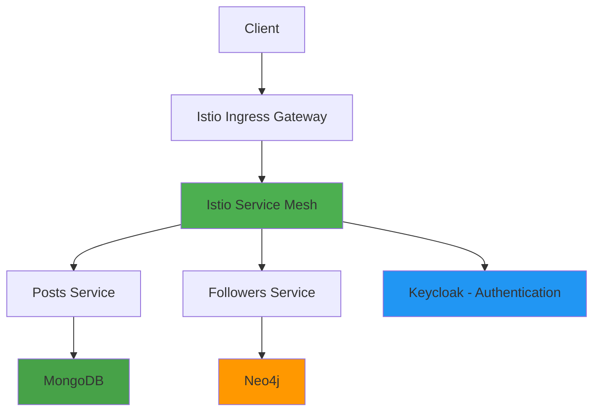

[View Source Code on GitHub](https://github.com/rayen-dhmaied/hornet) →

## Overview

### What it is
HorNet (Horizon Social Network) - Microservices-based social network backend with two Go services: Posts Service managing user posts with MongoDB, and Followers Service handling follower relationships with Neo4j. Deployed on Kubernetes with Istio service mesh.

### Why it exists
Academic project to demonstrate microservices architecture with polyglot persistence, service mesh security, and modern containerization practices. Required separation of concerns between content management and social graph operations with independent scalability.

### Outcome

:::tip Key Results
- **Polyglot persistence** - MongoDB for posts, Neo4j for social graph
- **Service mesh security** - Istio for mTLS and request authentication with Keycloak
- **Clean architecture** - Handler → Service → Repository pattern per microservice
- **Container-native** - Multi-stage Docker builds with distroless images (under 10MB)
- **Scalable architecture** - Independent services that scale based on workload
:::

---

## Architecture

### High-level Flow



:::info Key Components
**2 Go Microservices** → **Istio** (mTLS + Keycloak auth) → **MongoDB** (posts) + **Neo4j** (followers)
:::

---

## Tech Stack

**Backend:** Go, Gin framework  
**Databases:** MongoDB, Neo4j  
**Service Mesh:** Istio  
**Authentication:** Keycloak  
**Container & Orchestration:** Docker, Kubernetes  
**Build Tools:** Make  

---

## Implementation Setup

### Microservices Architecture
Built two independent Go services following clean architecture pattern:

**Posts Service (MongoDB):**
- Create, read, update, delete user posts
- Post content storage and retrieval
- User timeline queries
- **Structure:** Handler → Service → Repository pattern
- **API:** RESTful endpoints with OpenAPI specification (`api/openapi/posts.json`)

**Followers Service (Neo4j):**
- Follow/unfollow users
- Manage follower relationships
- Query followers and following lists
- Friend suggestions based on graph traversal
- **Structure:** Handler → Service → Repository pattern
- **API:** RESTful endpoints with OpenAPI specification (`api/openapi/followers.json`)

**Project Organization:**
- **`cmd/`**: Service entry points (`posts/main.go`, `followers/main.go`)
- **`api/`**: HTTP handlers, models, repositories, services, routers
- **`config/`**: Configuration management per service
- **`common/`**: Shared utilities (logger)
- **`Makefile`**: Build automation (build, lint, format, docker)

### Multi-Stage Docker Builds
Optimized Dockerfile used for both services:

```dockerfile
FROM golang:1.23.2 AS builder
ARG SERVICE
WORKDIR /app
COPY . .
ENV CGO_ENABLED=0
RUN go mod download
RUN go build -o app -ldflags="-s -w" ./cmd/${SERVICE}/main.go

FROM gcr.io/distroless/static-debian12 AS runtime
ARG PORT
COPY --from=builder ./app ./
EXPOSE ${PORT}/tcp
ENV GIN_MODE=release
ENTRYPOINT ["./app"]
```

**Key optimizations:**
- **Builder stage:** Full Go toolchain for compilation
- **Runtime stage:** Distroless static image (no shell, no package manager)
- **CGO disabled:** Static binary with no external dependencies
- **Binary stripping:** `-ldflags="-s -w"` removes debug info and symbol table
- **Build args:** `SERVICE` (tweet/social-graph), `PORT` (service port)
- **Result:** Images under 10MB per service

### Database Design

**MongoDB Schema (Posts Service):**
- **Collection: posts**
  - Fields: user_id, content, created_at, updated_at
  - Indexes: user_id for efficient user timeline queries
- **Document-based storage:** Flexible schema for post attributes
- **Queries:** Find by user_id, sort by created_at for timeline

**Neo4j Graph Model (Followers Service):**
- **User nodes:** Properties include user_id, username
- **FOLLOWS relationships:** Directional edges (User A → User B)
- **Cypher queries:** 
  - Get followers: `MATCH (follower)-[:FOLLOWS]->(user) WHERE user.user_id = $id`
  - Get following: `MATCH (user)-[:FOLLOWS]->(following) WHERE user.user_id = $id`
  - Friend suggestions: Graph traversal for mutual connections

### Build System
Makefile commands for development workflow:
```bash
# Build service binary
make build SERVICE=posts

# Build Docker container
make build-container SERVICE=followers PORT=8081

# Run locally
make run SERVICE=posts

# Code quality
make lint
make fmt

# Cleanup
make clean
```

### Istio Service Mesh Configuration

**mTLS Enforcement:**
- Strict mutual TLS between services
- Automatic certificate rotation
- Encrypted service-to-service communication

**Authentication with Keycloak:**
- Istio RequestAuthentication configured with Keycloak JWKS endpoint
- JWT token validation at ingress gateway
- AuthorizationPolicy enforcing authenticated requests
- Services receive validated user context in headers

**Traffic Management:**
- Load balancing across service replicas
- Retries and circuit breaking
- Timeout policies

### Deployment Strategy
- **Kubernetes Deployments:** One per microservice with multiple replicas
- **Services:** ClusterIP for internal communication
- **Istio VirtualService:** Routing rules for external access
- **Environment Variables:**
  - **Posts Service:** `POSTS_PORT`, `MONGO_URI`, `MONGO_DB`, `FOLLOWERS_SERVICE_URL`
  - **Followers Service:** `FOLLOWERS_PORT`, `NEO4J_URI`, `NEO4J_DB`, `NEO4J_USER`, `NEO4J_PASSWORD`, `POSTS_SERVICE_URL`
- **Service Discovery:** Services communicate via internal URLs
- **ConfigMaps:** Database connection strings, service URLs
- **Secrets:** Database credentials

---

## Key Challenges & Solutions

### Challenge 1: Implementing Polyglot Persistence

**Problem:** Social network required both document-based content storage (posts with flexible attributes) and complex relationship queries (followers, mutual connections). Single database couldn't efficiently handle both workloads.

**Solution:** Split into two microservices with specialized databases. Posts Service uses MongoDB for flexible document storage and efficient queries by user_id. Followers Service uses Neo4j for relationship traversals and graph algorithms. Services communicate via REST APIs when cross-database queries needed (e.g., fetching posts from followed users requires calling Followers Service for list, then Posts Service for content).

:::success Result
**Optimized performance** - MongoDB's document model handles varied post attributes efficiently, Neo4j graph traversal enables sub-second follower queries
:::

---

### Challenge 2: Authentication at Service Mesh Layer

**Problem:** Each microservice shouldn't handle authentication logic directly - creates code duplication and security risks. Needed centralized authentication enforcement.

**Solution:** Configured Istio RequestAuthentication with Keycloak as JWT issuer. Istio validates JWT tokens at ingress gateway before routing to services. Services receive pre-validated user identity in request headers (`x-auth-request-user`). No authentication code needed in service logic.

:::success Result
**Zero-trust security** - Authentication enforced at mesh layer, services trust Istio-validated requests, single point of auth policy
:::

---

### Challenge 3: Optimizing Docker Image Size

**Problem:** Standard Go Docker images with full OS base exceeded 100MB, slow to push/pull and increased attack surface with unnecessary packages.

**Solution:** Implemented multi-stage builds with distroless base image. Builder stage compiles Go binary with CGO disabled for static linking. Runtime stage contains only the binary - no shell, no package manager. Used `-ldflags="-s -w"` to strip debug symbols.

:::success Result
**90% size reduction** - Final images under 10MB, faster deployments, minimal attack surface
:::