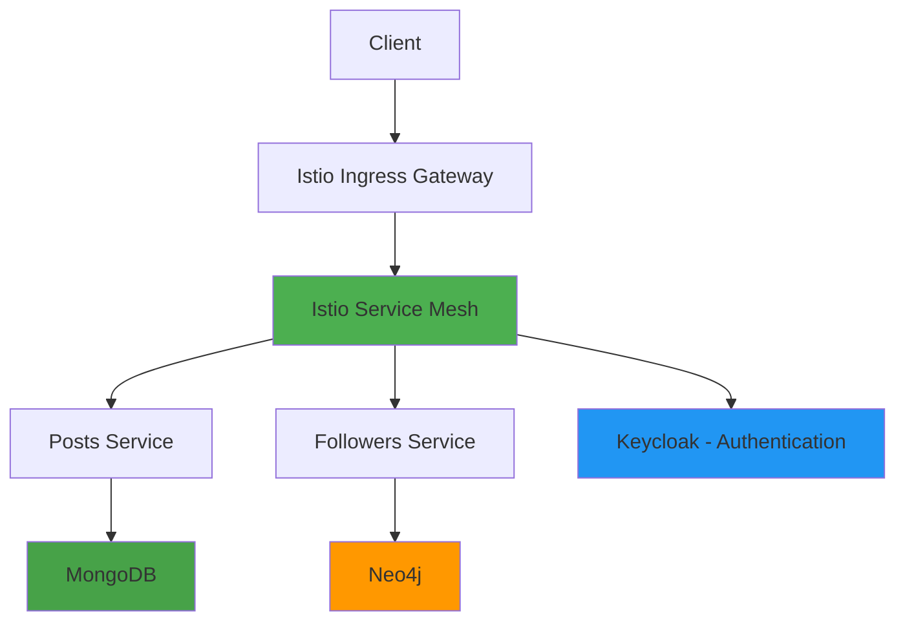

[View Source Code on GitHub](https://github.com/rayen-dhmaied/hornet) →

## Overview

### What it is
Horizon Social Network is a Go backend for a campus social platform. It has two services: Posts stores user posts in MongoDB, and Followers stores the social graph in Neo4j.

Both services run on Kubernetes behind Istio. Keycloak handles identity, the Istio ingress gateway validates JWTs, and the mesh encrypts service-to-service traffic with mTLS.

### Why it exists
I built it as part of a university workshop project to apply microservices and Kubernetes concepts in practice. I treated it like a production backend: posts and follower relationships have different data shapes, so I split them into separate services with separate databases instead of forcing both workloads into one model.

The workshop gave me room to apply the parts I care about as a cloud and DevOps engineer: container builds, Kubernetes deployment, service mesh policy, auth at the edge, and clear service boundaries.

### Outcome

:::tip Key Results
- Two Go services with handler, service, and repository layers
- MongoDB stores post documents and timeline queries
- Neo4j stores `User` nodes and `FOLLOWS` relationships
- Istio validates Keycloak JWTs at ingress and enforces mTLS in the mesh
- Multi-stage Docker builds produce distroless images under 10MB per service
- Kubernetes manifests cover deployments, services, config, secrets, and Istio routing
:::

---

## Architecture

### High-Level Flow


```mermaid
graph TD
    A[Client] --> B[Istio Ingress Gateway]
    B --> C[Istio Service Mesh]
    C --> D[Posts Service]
    C --> E[Followers Service]

    C --> F[Keycloak - Authentication]
    D --> G[MongoDB]
    E --> H[Neo4j]

    style C fill:#4CAF50
    style F fill:#2196F3
    style G fill:#47A248
    style H fill:#FF9800
```

:::info Key Components
The client enters through the Istio ingress gateway. Istio validates the Keycloak JWT before the request reaches a service, then routes traffic through the mesh. Posts reads and writes MongoDB documents. Followers handles graph queries in Neo4j.
:::

---

## Tech Stack

**Backend:** Go, Gin  
**Databases:** MongoDB, Neo4j  
**Service Mesh:** Istio  
**Authentication:** Keycloak  
**Container & Orchestration:** Docker, Kubernetes  
**Build Tools:** Make

---

## Implementation Setup

### Service Layout
Each service follows the same Go structure: handler -> service -> repository.

**Posts Service:**
- CRUD for user posts
- Timeline queries by `user_id`
- MongoDB repository with an index on `user_id`
- OpenAPI spec at `api/openapi/posts.json`

**Followers Service:**
- Follow and unfollow operations
- Followers and following lookups
- Friend suggestions through graph traversal
- Neo4j repository with Cypher queries
- OpenAPI spec at `api/openapi/followers.json`

**Project Layout:**
- `cmd/`: service entry points for `posts` and `followers`
- `api/`: handlers, models, repositories, services, and routers
- `config/`: per-service configuration
- `common/`: shared logger
- `Makefile`: build, lint, format, Docker targets, and cleanup

### Docker Builds
One Dockerfile builds both services through build args:

```dockerfile
FROM golang:1.23.2 AS builder
ARG SERVICE
WORKDIR /app
COPY . .
ENV CGO_ENABLED=0
RUN go mod download
RUN go build -o app -ldflags="-s -w" ./cmd/${SERVICE}/main.go

FROM gcr.io/distroless/static-debian12 AS runtime
ARG PORT
COPY --from=builder ./app ./
EXPOSE ${PORT}/tcp
ENV GIN_MODE=release
ENTRYPOINT ["./app"]
```

Build choices:
- Builder stage keeps the Go toolchain out of the runtime image
- `CGO_ENABLED=0` creates a static binary
- `-ldflags="-s -w"` strips debug data and the symbol table
- Distroless runtime removes shell and package manager surface area
- `SERVICE` and `PORT` choose the target service at build time

### Database Design

**MongoDB for Posts:**
- `posts` collection with `user_id`, `content`, `created_at`, and `updated_at`
- `user_id` index for timeline reads
- Document structure leaves room for post fields such as media, reactions, or visibility settings

**Neo4j for Followers:**
- `User` nodes with `user_id` and `username`
- Directional `FOLLOWS` relationships
- Cypher queries for followers, following, and mutual-connection suggestions

Example queries:
- Followers: `MATCH (follower)-[:FOLLOWS]->(user) WHERE user.user_id = $id`
- Following: `MATCH (user)-[:FOLLOWS]->(following) WHERE user.user_id = $id`
- Suggestions: traverse mutual connections and exclude users already followed

### Build System
The Makefile keeps the local loop short:

```bash
make build SERVICE=posts
make build-container SERVICE=followers PORT=8081
make run SERVICE=posts
make lint
make fmt
make clean
```

### Istio and Keycloak

**mTLS:**
- Istio enforces mutual TLS between services
- Istio handles certificate rotation
- Services communicate over in-mesh ClusterIP routes

**Authentication:**
- `RequestAuthentication` points to the Keycloak JWKS endpoint
- `AuthorizationPolicy` rejects unauthenticated requests at ingress
- Services receive validated identity headers instead of parsing JWTs themselves

**Traffic policy:**
- Load balancing across replicas
- Timeouts for service calls
- Retry and circuit-breaking policy at the mesh layer

### Kubernetes Deployment
- One Deployment per service
- ClusterIP Services for in-mesh traffic
- Istio `VirtualService` for external routes
- ConfigMaps for service URLs and non-secret connection settings
- Secrets for MongoDB and Neo4j credentials
- Environment variables for ports, database URIs, and service URLs

Service configuration:
- Posts: `POSTS_PORT`, `MONGO_URI`, `MONGO_DB`, `FOLLOWERS_SERVICE_URL`
- Followers: `FOLLOWERS_PORT`, `NEO4J_URI`, `NEO4J_DB`, `NEO4J_USER`, `NEO4J_PASSWORD`, `POSTS_SERVICE_URL`

---

## Key Challenges & Solutions

### Challenge 1: Choosing the Right Database Per Workload

**Problem:** Posts fit a document model. Followers fit a graph model. Putting both in one database would either complicate timeline reads or push graph traversal into application code.

**Solution:** I split the backend by workload. Posts uses MongoDB for document storage and indexed timeline reads. Followers uses Neo4j for relationship traversal and friend suggestions. When a feature needs both sides, one service calls the other over REST.

:::success Result
Each service uses a database that matches its query pattern. Friend suggestions stay in Cypher instead of turning into nested application-side joins.
:::

---

### Challenge 2: Keeping Auth Out of Each Service

**Problem:** Adding JWT parsing to each service would duplicate security code. A third service would need the same middleware again.

**Solution:** I moved authentication to Istio. The ingress gateway validates Keycloak JWTs through `RequestAuthentication`, and `AuthorizationPolicy` blocks unauthenticated traffic before it reaches Go. Services read the identity headers Istio passes through.

:::success Result
The Go services do not carry JWT parsing code. A new service can join the mesh and inherit the same auth policy.
:::

---

### Challenge 3: Shrinking Runtime Images

**Problem:** A Go binary on a standard Linux base image produced images over 100MB. That slowed image pulls and shipped packages the services did not need.

**Solution:** I used multi-stage builds. The builder image compiles a static Go binary, and the runtime image uses `gcr.io/distroless/static-debian12`. The final image contains the binary and little else.

:::success Result
Each service image dropped below 10MB, about a 90% reduction from the distro-base build.
:::
