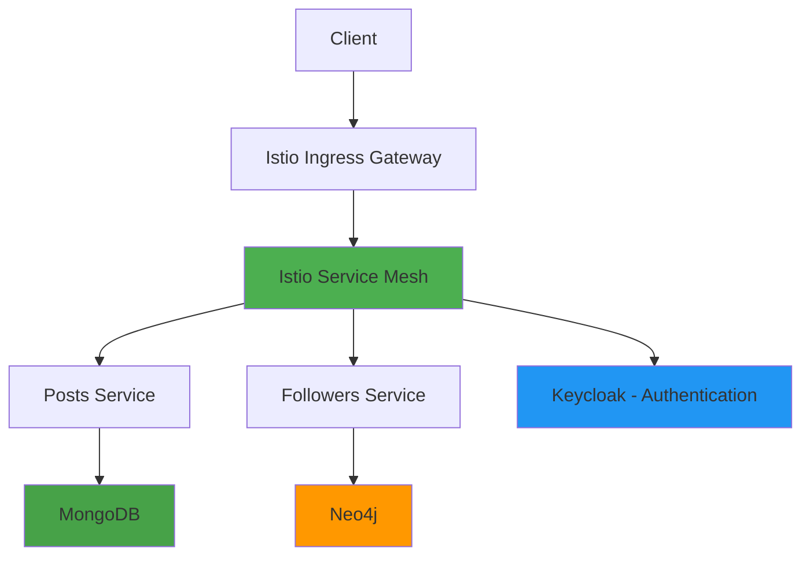

[View Source Code on GitHub](https://github.com/rayen-dhmaied/hornet) →

## Overview

### What it is
HorNet (Horizon Social Network) is the backend of a small social network, split into two Go services. The Posts service stores user posts in MongoDB; the Followers service models the social graph in Neo4j. Both run on Kubernetes with Istio in front and Keycloak handling authentication.

### Why it exists
A university project. The interesting design call was the database side: posts and followers are different shapes of data, so each side gets its own service and its own database. Splitting them also lets each scale independently and keeps the two query styles (Cypher graph traversal and MongoDB document queries) inside their own service boundary.

### Outcome

:::tip Key Results
- MongoDB for post documents, Neo4j for the follower graph
- Istio handles mTLS between services and JWT validation against Keycloak at the ingress gateway
- Handler → Service → Repository layering inside each service
- Multi-stage builds with distroless base images, under 10MB per service
:::

---

## Architecture

### High-level Flow


```mermaid
graph TD
    A[Client] --> B[Istio Ingress Gateway]
    B --> C[Istio Service Mesh]
    C --> D[Posts Service]
    C --> E[Followers Service]

    C --> F[Keycloak - Authentication]
    D --> G[MongoDB]
    E --> H[Neo4j]

    style C fill:#4CAF50
    style F fill:#2196F3
    style G fill:#47A248
    style H fill:#FF9800
```

:::info Key Components
Two Go microservices behind Istio. The ingress gateway validates the JWT against Keycloak before any service sees the request, and the mesh enforces mTLS between services. Posts writes to MongoDB; Followers writes to Neo4j.
:::

---

## Tech Stack

**Backend:** Go, Gin framework  
**Databases:** MongoDB, Neo4j  
**Service Mesh:** Istio  
**Authentication:** Keycloak  
**Container & Orchestration:** Docker, Kubernetes  
**Build Tools:** Make

---

## Implementation Setup

### Microservices Architecture
Two independent Go services, each laid out the same way: handler → service → repository.

**Posts Service (MongoDB):**
- CRUD over user posts
- User-timeline queries
- RESTful endpoints with an OpenAPI spec at `api/openapi/posts.json`

**Followers Service (Neo4j):**
- Follow / unfollow
- Followers and following lookups
- Friend suggestions via graph traversal
- RESTful endpoints with an OpenAPI spec at `api/openapi/followers.json`

**Project Layout:**
- `cmd/`: service entry points (`posts/main.go`, `followers/main.go`)
- `api/`: HTTP handlers, models, repositories, services, routers
- `config/`: per-service configuration
- `common/`: shared utilities (logger)
- `Makefile`: build, lint, format, docker

### Multi-Stage Docker Builds
One Dockerfile, parameterised with build args, used for both services:

```dockerfile
FROM golang:1.23.2 AS builder
ARG SERVICE
WORKDIR /app
COPY . .
ENV CGO_ENABLED=0
RUN go mod download
RUN go build -o app -ldflags="-s -w" ./cmd/${SERVICE}/main.go

FROM gcr.io/distroless/static-debian12 AS runtime
ARG PORT
COPY --from=builder ./app ./
EXPOSE ${PORT}/tcp
ENV GIN_MODE=release
ENTRYPOINT ["./app"]
```

Notes on the build:
- Builder stage carries the full Go toolchain and compiles the binary
- Runtime is `distroless/static-debian12`: no shell, no package manager
- `CGO_ENABLED=0` produces a static binary with no libc dependency
- `-ldflags="-s -w"` strips debug info and the symbol table
- `SERVICE` (`posts` / `followers`) and `PORT` are passed in as build args
- Final image: under 10MB per service

### Database Design

**MongoDB (Posts):**
- Collection `posts` with `user_id`, `content`, `created_at`, `updated_at`
- Index on `user_id` for the timeline query
- Document layout leaves room to add post attributes without a migration

**Neo4j (Followers):**
- `User` nodes carrying `user_id` and `username`
- `FOLLOWS` directional relationships (`User A` → `User B`)
- Cypher queries:
  - Followers: `MATCH (follower)-[:FOLLOWS]->(user) WHERE user.user_id = $id`
  - Following: `MATCH (user)-[:FOLLOWS]->(following) WHERE user.user_id = $id`
  - Friend suggestions: graph traversal over mutual connections

### Build System
Makefile targets cover the development loop:
```bash
make build SERVICE=posts
make build-container SERVICE=followers PORT=8081
make run SERVICE=posts
make lint
make fmt
make clean
```

### Istio Service Mesh Configuration

**mTLS:**
- Strict mutual TLS between services
- Certificate rotation handled by Istio
- Service-to-service traffic is encrypted end to end

**Authentication via Keycloak:**
- Istio `RequestAuthentication` points at the Keycloak JWKS endpoint
- The ingress gateway validates the JWT before any service sees the request
- An `AuthorizationPolicy` rejects unauthenticated traffic
- Services receive the validated user identity in request headers

**Traffic management:**
- Load balancing across replicas
- Retries and circuit breaking
- Timeout policies

### Deployment Strategy
- One Kubernetes Deployment per service with multiple replicas
- ClusterIP services for in-mesh traffic
- Istio `VirtualService` for external routing
- Environment variables:
  - Posts: `POSTS_PORT`, `MONGO_URI`, `MONGO_DB`, `FOLLOWERS_SERVICE_URL`
  - Followers: `FOLLOWERS_PORT`, `NEO4J_URI`, `NEO4J_DB`, `NEO4J_USER`, `NEO4J_PASSWORD`, `POSTS_SERVICE_URL`
- Service discovery through internal cluster URLs
- ConfigMaps for connection strings and service URLs
- Secrets for database credentials

---

## Key Challenges & Solutions

### Challenge 1: Picking the Right Database for Each Side

**Problem:** Posts are document-shaped, with attributes I knew would change as features arrived. Followers are graph-shaped, with the interesting queries being multi-hop traversals like mutual connections and friend suggestions. Forcing both into one database meant either schema churn on the post side or recursive joins on the follower side.

**Solution:** I split the workload into two services. Posts on MongoDB, where the document model absorbs new attributes without a migration and an index on `user_id` covers the timeline query. Followers on Neo4j, where Cypher does graph traversal in one query instead of N application-side joins. When a feature needs both (a feed of posts from people you follow), one service calls the other over REST.

:::success Result
Each side runs against the database its workload fits. Friend-suggestion queries are one Cypher traversal instead of a join chain.
:::

---

### Challenge 2: Authentication at the Mesh Layer

**Problem:** Authenticating in every service means duplicate JWT-parsing code in two places today and four places tomorrow, and one of those copies will eventually drift.

**Solution:** I moved authentication out of the services. An Istio `RequestAuthentication` validates JWTs against Keycloak at the ingress gateway. An `AuthorizationPolicy` rejects unauthenticated requests before they reach any service. Each service trusts the headers Istio injects (`x-auth-request-user`) and reads identity from there.

:::success Result
The services contain no auth code. A new service joins the mesh and inherits the same auth posture without any JWT-parsing code of its own.
:::

---

### Challenge 3: Shrinking the Docker Images

**Problem:** A Go binary inside a standard distro base image landed over 100MB. Push and pull are slow on a slow link, and the base image carries a stack of packages neither service uses.

**Solution:** Multi-stage builds. The builder stage holds the full Go toolchain and produces a statically linked binary (`CGO_ENABLED=0`). The runtime stage is `gcr.io/distroless/static-debian12`: no shell, no package manager, just the binary. `-ldflags="-s -w"` strips the debug info and symbol table.

:::success Result
Each image dropped to under 10MB, about a 90% cut from the distro-base build.
:::
