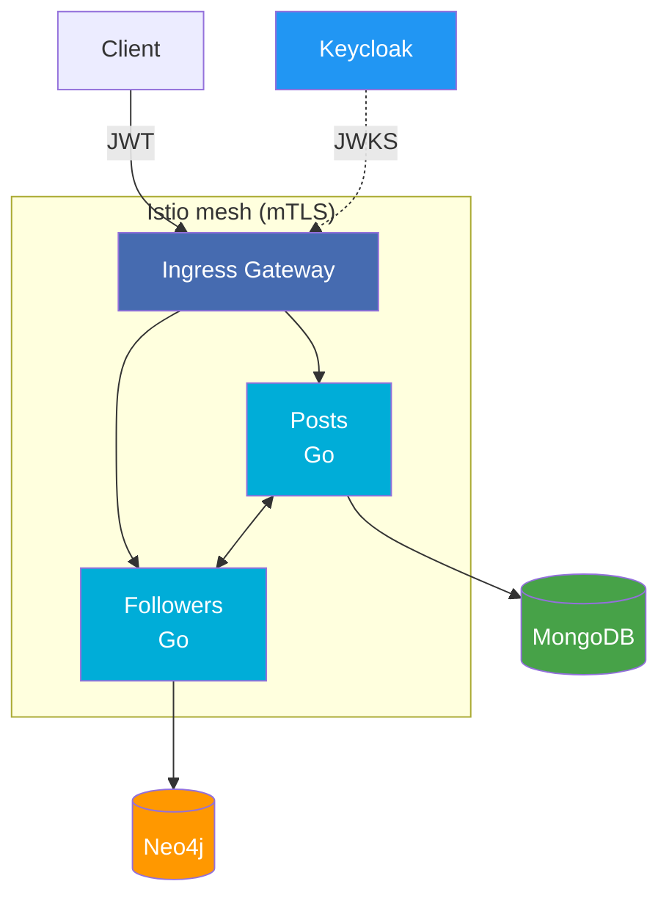

[View Source Code on GitHub](https://github.com/rayen-dhmaied/hornet) →

## Overview

### What it is
Horizon Social Network is a Go backend for a campus social platform. It has two services: Posts stores user posts in MongoDB, and Followers stores the social graph in Neo4j.

Both services run on Kubernetes behind Istio. Keycloak handles identity, the Istio ingress gateway validates JWTs, and the mesh encrypts service-to-service traffic with mTLS.

### Why it exists
I built it as part of a university workshop project to apply microservices and Kubernetes concepts in practice. I treated it like a production backend: posts and follower relationships have different data shapes, so I split them into separate services with separate databases instead of forcing both workloads into one model.

The workshop gave me room to apply the parts I care about as a cloud and DevOps engineer: container builds, Kubernetes deployment, service mesh policy, auth at the edge, and clear service boundaries.

### Outcome

:::tip Key Results
- Distroless images under 10MB per service, about 90% smaller than the distro-base build
- One database per workload: MongoDB for posts and timelines, Neo4j for the follower graph
- Istio validates Keycloak JWTs at ingress and enforces mTLS; the Go services carry no auth code
- Full Kubernetes deployment: manifests, config, secrets, and Istio routing
:::

---

## Architecture

### High-Level Flow

```mermaid
graph TD
    C[Client] -->|JWT| IG
    KC[Keycloak] -.->|JWKS| IG

    subgraph MESH ["Istio mesh (mTLS)"]
        IG[Ingress Gateway] --> PS[Posts<br/>Go]
        IG --> FS[Followers<br/>Go]
        PS <--> FS
    end

    PS --> M[(MongoDB)]
    FS --> N[(Neo4j)]

    style IG fill:#466BB0,color:#fff
    style PS fill:#00ADD8,color:#fff
    style FS fill:#00ADD8,color:#fff
    style M fill:#47A248,color:#fff
    style N fill:#FF9800,color:#fff
    style KC fill:#2196F3,color:#fff
```

:::info Key Components
The client enters through the Istio ingress gateway. Istio validates the Keycloak JWT before the request reaches a service, then routes traffic through the mesh. Posts reads and writes MongoDB documents. Followers handles graph queries in Neo4j.
:::

---

## Implementation Highlights

- Both services follow the same Go layout (handler, service, repository) with OpenAPI specs, built through one Dockerfile that selects the target service with a build arg.
- MongoDB stores post documents with a `user_id` index for timeline reads. Neo4j stores `User` nodes and directional `FOLLOWS` relationships, so friend suggestions stay in Cypher instead of application-side joins.
- Istio enforces mTLS between services and validates Keycloak JWTs at ingress through `RequestAuthentication` and `AuthorizationPolicy`. Services read identity headers instead of parsing tokens.
- Kubernetes manifests cover Deployments, ClusterIP services, Istio routing, ConfigMaps for connection settings, and Secrets for database credentials.

---

## Key Challenges & Solutions

### Challenge 1: Choosing the Right Database Per Workload

**Problem:** Posts fit a document model. Followers fit a graph model. Putting both in one database would either complicate timeline reads or push graph traversal into application code.

**Solution:** I split the backend by workload. Posts uses MongoDB for document storage and indexed timeline reads. Followers uses Neo4j for relationship traversal and friend suggestions. When a feature needs both sides, one service calls the other over REST.

:::success Result
Each service uses a database that matches its query pattern. Friend suggestions stay in Cypher instead of turning into nested application-side joins.
:::

---

### Challenge 2: Keeping Auth Out of Each Service

**Problem:** Adding JWT parsing to each service would duplicate security code. A third service would need the same middleware again.

**Solution:** I moved authentication to Istio. The ingress gateway validates Keycloak JWTs through `RequestAuthentication`, and `AuthorizationPolicy` blocks unauthenticated traffic before it reaches Go. Services read the identity headers Istio passes through.

:::success Result
The Go services do not carry JWT parsing code. A new service can join the mesh and inherit the same auth policy.
:::

