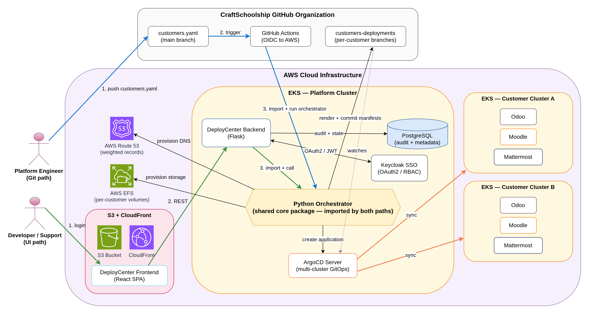

## Overview

### What it is
Internal web-based platform that automates the deployment of customer applications to multiple Kubernetes clusters. Provides secure dashboard for company developers to manage deployments through a template-driven workflow instead of manual manifest creation.

### Why it exists
Previously, deploying customer applications required manually creating Kubernetes manifests, filling Helm values, and provisioning AWS resources - taking ~15 minutes per application with high risk of human error. Needed a standardized, secure, and efficient way for internal developers to deploy customer applications.

### Outcome

:::tip Key Results
- **80% time reduction** - From ~15 minutes to ~3 minutes per deployment
- **Zero manual manifest creation** - Automated generation from templates
- **Secure access control** - Keycloak SSO integration with role-based permissions
- **Full GitOps workflow** - Declarative deployments with Git as single source of truth
:::

---

## Architecture

### Architecture Diagram

:::info Key Components
**DeployCenter** (React frontend + Flask backend) → **Keycloak SSO** (authentication/authorization) → **GitHub API** (manifest storage) → **ArgoCD** (multi-cluster GitOps) → **EKS clusters** (customer apps) → **AWS** (EFS, Route53, S3)
:::

---

## Tech Stack

**Backend:** Flask (Python), PostgreSQL  
**Frontend:** React, hosted on S3 + CloudFront  
**Authentication:** Keycloak (SSO, user management, RBAC)  
**GitOps:** ArgoCD, Git, Helm  
**Cloud:** AWS (EKS, EFS, Route53, Boto3)

---

## Implementation Setup

### Backend Development (Flask)
Built Flask-based backend server with integrations for:
- **Keycloak authentication:** OAuth2 flow for SSO, JWT token validation, role-based access control
- **AWS API integration:** Automated provisioning of EFS volumes, Route53 DNS records, S3 buckets
- **GitHub API integration:** Programmatic repository operations for manifest/values file commits
- **ArgoCD API integration:** Application creation and sync operations across multiple clusters
- **Template engine:** Generates Kubernetes manifests and Helm values from predefined templates
- **Database layer:** PostgreSQL for customer metadata, application configurations, deployment templates

### Frontend Development (React)
Developed React-based dashboard featuring:
- **Authentication:** Keycloak integration with OAuth2 flow
- **Customer management:** Create/edit/delete customers
- **Application deployment wizard:** Select templates, configure parameters, deploy
- **Resource management:** View and manage available deployment templates
- **Deployment monitoring:** Real-time status of ArgoCD sync operations
- **Audit interface:** Deployment history and change logs

### Template System
Created reusable templates for:
- **Application and their resources:** Such as Odoo, Moodle, PostgreSQL.. with environment-specific configurations
- **Kubernetes manifests:** Deployments, Services, Ingress, ConfigMaps, Secrets
- **Helm values:** Pre-configured values with customer-specific placeholders
- **AWS resources:** EFS access point configurations, Route53 record templates

### Deployment Workflow
**Automated provisioning process:**
1. Developer logs in via Keycloak SSO
2. Selects customer and application template from dashboard
3. Fills in configuration parameters (domain, resources, etc.)
4. Backend generates manifests and Helm values from templates
5. Provisions AWS resources (EFS, Route53, S3) via boto3
6. Commits generated files to `customers-deployments` Git repository
7. Calls ArgoCD API to create application pointing to Git repo
8. ArgoCD syncs application state to cluster
9. Customer application running in ~3 minutes

:::note GitOps Workflow
All deployments are Git-driven. ArgoCD continuously monitors the repository and ensures cluster state matches Git state, enabling easy rollbacks and audit trails.
:::

### Multi-Cluster Management
- **ArgoCD integration:** Single ArgoCD instance managing multiple EKS clusters
- **Cluster routing:** Backend determines target cluster based on customer configuration
- **Namespace isolation:** Each customer application deployed to dedicated namespace

### CI/CD Pipelines

**Backend Pipeline (GitFlow):**
- Automated testing on pull requests
- Build Docker image for Flask application
- Push to container registry
- Helm chart deployment to EKS cluster
- Rolling updates with zero downtime

**Frontend Pipeline:**
- Build React application (production bundle)
- Upload build artifacts to S3 bucket
- Invalidate CloudFront cache for immediate updates
- Versioned deployments with rollback capability

### Infrastructure Setup
- **Backend hosting:** Flask application containerized and deployed to EKS via Helm chart
- **Frontend hosting:** React SPA served from S3 bucket behind CloudFront CDN
- **Database:** PostgreSQL for application state and metadata
- **Storage:** EFS for customer application persistent data
- **DNS:** Route53 for custom domain management per customer

---

## Key Challenges & Solutions

### Challenge 1: Reducing Deployment Time from 15 Minutes to 3 Minutes

**Problem:** Manual process involved creating Kubernetes manifests, filling Helm values, provisioning AWS resources, committing to Git, and triggering ArgoCD - taking ~15 minutes and prone to errors.

**Solution:** Built template-driven automation in Flask backend that generates all required files from templates. Single API call orchestrates AWS resource provisioning, Git commits, and ArgoCD application creation. Parallel execution of independent tasks (AWS provisioning + manifest generation) reduces total time.

:::success Result
**80% time reduction** - Deployment process automated from ~15 minutes to ~3 minutes with a few clicks
:::

---

### Challenge 2: Integrating Four Different Systems

**Problem:** Solution required coordinating Keycloak (authentication), GitHub (version control), ArgoCD (deployment), and AWS (infrastructure) - each with different APIs, authentication methods, and error handling patterns.

**Solution:** Developed service layer abstraction in Flask with dedicated modules for each integration. Implemented unified error handling, retry logic with exponential backoff, and transaction-like workflows. Created rollback mechanisms to clean up resources if any step fails.

:::success Result
**Seamless multi-system orchestration** - Single user action triggers coordinated operations across all systems with automatic rollback on failure
:::

---

### Challenge 3: Secure Multi-Tenant Access Control

**Problem:** Multiple developers needed access with different permission levels. Some should only view deployments, others deploy, and admins manage everything. Security was critical as tool manages production customer applications.

**Solution:** Integrated Keycloak for centralized authentication and role-based access control (RBAC). Defined roles (viewer, deployer, admin) with granular permissions. Implemented OAuth2 authorization code flow in both backend (Flask) and frontend (React). All API endpoints protected with JWT token validation and role checks.

:::success Result
**Enterprise-grade security** - Role-based access control with SSO, ensuring only authorized developers can perform deployment operations
:::

---

### Challenge 4: Template Management and Flexibility

**Problem:** Different customer applications required different configurations, but wanted to avoid duplicating manifests. Needed balance between standardization and customization.

**Solution:** Created hierarchical template system with base templates for common configurations and application-specific overlays. Used Jinja2 templating engine for variable substitution. Built template management interface in frontend for adding/editing templates without code changes.

:::success Result
**Flexible standardization** - Reusable templates reduce configuration drift while allowing customization per customer needs
:::