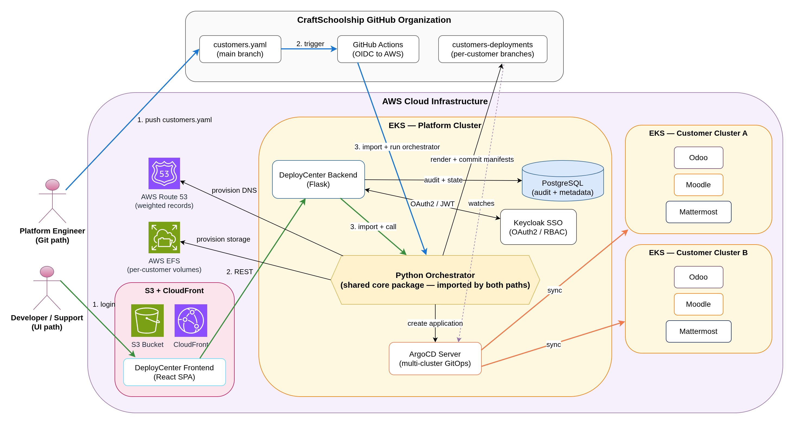

## Overview

### What it is
An internal platform that provisions customer apps on multi-region EKS clusters. It currently runs Odoo, Moodle, and Mattermost, and new apps onboard by adding a template set. Engineers deploy through a React dashboard backed by Flask, or commit to a single `customers.yaml` file that triggers the same pipeline.

### Why it exists
Deploying a customer app used to mean writing Kubernetes manifests by hand, filling Helm values, provisioning EFS volumes and Route53 records in the AWS console, then committing to Git. Each app took 15 minutes and broke when someone mistyped a value.

The team needed both paths: YAML for engineers who already lived in the repo, and a UI for support staff and junior developers who should deploy without write access.

### Outcome

:::tip Key Results
- Per-app deploy time: 15 minutes down to 3
- 20+ customers running on 3 AWS regions, no hand-written manifests
- Extensible to new apps via a template set, not a fork
- One automation engine behind two entry points (Git push or dashboard)
- Keycloak SSO with viewer, deployer, and admin roles
- Idempotent operations against AWS, GitHub, and ArgoCD
:::

---

## Background

The platform began as one repo: a `customers.yaml`, a Python script, and a GitHub Actions workflow. Engineers edited the YAML and pushed to `main`. The workflow rendered manifests, provisioned AWS resources, and committed to per-customer branches. ArgoCD synced the result.

That worked for the platform team. It did not work for support engineers and junior developers, who also needed to deploy customer apps. Giving them write access to the repo meant trusting every YAML edit on `main`. Walking each newcomer through Git, conflict resolution, and CI failures took days.

I built **DeployCenter** on top of the existing automation. The Python orchestrator became an importable package. Flask wrapped it with auth, input validation, and a PostgreSQL audit trail, and the React dashboard sat in front. Keycloak roles let a support engineer trigger a Mattermost redeploy without ever touching the repo.

The original Git-driven workflow kept running. Today, platform engineers push `customers.yaml` for batch changes; support staff click through the dashboard for one-off deploys. Both routes share one renderer and one set of provisioning code.

---

## Architecture

### Architecture Diagram

### How a Deploy Flows

Both paths run through the same Python orchestration core.

**Git-driven path:** an engineer edits `customers.yaml` on `main`. GitHub Actions runs the orchestrator, which renders manifests, provisions AWS resources, and commits to per-customer branches. ArgoCD detects the change and syncs to the target cluster.

**UI-driven path:** a developer signs in through Keycloak, fills a form on the React dashboard, and clicks deploy. The Flask backend invokes the same orchestrator code and writes audit records to PostgreSQL.

:::info Key Components
React dashboard (S3 + CloudFront) → Flask API (EKS) → Python orchestrator → ArgoCD (multi-cluster) → EKS clusters → AWS (EFS, Route53, S3)

Parallel path: GitHub Actions → same Python orchestrator → same downstream targets
:::

---

## Tech Stack

**Backend:** Flask, Python 3.10, PostgreSQL, Jinja2, Boto3, GitPython  
**Frontend:** React, S3 + CloudFront  
**Authentication:** Keycloak (OAuth2, RBAC)  
**GitOps:** ArgoCD, Helm, GitHub  
**Cloud:** AWS (EKS, EFS, Route53, S3, IAM OIDC)  
**CI/CD:** GitHub Actions, Helm-based EKS rollouts

---

## Implementation Setup

### Orchestration Core
A Python package handles every step both interfaces depend on:
- Renders Kubernetes manifests and Helm values from Jinja2 templates using custom delimiters (`[[ ]]`) so they don't collide with Helm syntax
- Provisions EFS filesystems and Route53 weighted A-records via Boto3, caching clients and lookups so repeat runs skip the API
- Calls ArgoCD's REST API with exponential backoff on 429 and 5xx
- Uses GitPython to commit generated manifests to per-customer branches
- Treats every operation as idempotent: GET before POST, write to disk only when content differs

### Flask Backend
- Validates Keycloak JWTs on each request and checks role claims against endpoint requirements
- Stores customer metadata, deployment history, and template definitions in PostgreSQL
- Exposes REST endpoints for the React dashboard
- Wraps the orchestration package so one API call coordinates AWS provisioning, Git commits, and ArgoCD application creation
- Rolls back on failure: deletes AWS resources it created, reverts the Git commit, and removes the half-created ArgoCD app

### React Frontend
- Keycloak OAuth2 integration (authorization code flow with PKCE)
- Customer CRUD with form validation
- Deployment wizard: select customer, pick app template, fill region-specific values, deploy
- ArgoCD sync status polled from the backend
- Audit log view backed by PostgreSQL
- Template editor that lets admins update Jinja2 sources without opening the repo

### Git-Driven Path
Two GitHub Actions workflows cover the code-first interface.

The deploy workflow triggers on changes to `customers.yaml`. It assumes an AWS IAM role via OIDC (no static keys), runs the orchestrator, and pushes generated files to customer branches.

The sync workflow triggers when templates or orchestrator code change on `main`. It merges `main` into every customer branch so updates propagate without anyone re-editing `customers.yaml`.

### Template System
Templates live in the repo as Jinja2 files. Each app ships with:
- A Helm values template for the main workload
- An ArgoCD Application JSON for the GitOps spec
- Resource manifests for dependencies (PostgreSQL, Redis)

Odoo, Moodle, and Mattermost are wired up today. Adding a new app means dropping a new template set into the repo under its own name; the orchestrator picks it up without code changes.

Customers override values through `customers.yaml` keys (Git path) or the dashboard form (UI path). Both feed the same renderer, so a Helm values change ships once.

### Multi-Region Deployment
Each customer maps to an AWS region (US-WEST-2, EU-SOUTH-2, EU-WEST-3). The orchestrator loads region-specific env files on demand, caches Boto3 clients per region, and routes each downstream call to the right config. Route53 weighted records spread traffic across regional endpoints.

### CI/CD Pipelines

**Backend (GitFlow):** PR tests → Docker build → push to ECR → Helm upgrade on EKS with rolling updates.

**Frontend:** React production build → S3 sync → CloudFront invalidation. Build artifacts are versioned, so rollback is one command.

**Customer deployments:** GitHub Actions for the Git-driven path, Flask API for the UI path. Both produce the same manifests on the same branches.

---

## Key Challenges & Solutions

### Challenge 1: Two Interfaces, One Codebase

**Problem:** Some engineers wanted to keep editing `customers.yaml`. Others wanted a UI. Two parallel implementations would mean every template change had to land in two places, and the paths would drift within a sprint.

**Solution:** I extracted the deployment logic into a Python package with no dependency on Flask or GitHub Actions. The CI workflow imports it. The Flask backend imports it. Both call the same `deploy_customer_app()` entrypoint with the same input shape. The dashboard converts form fields into that input; the CI workflow reads `customers.yaml` and builds it.

:::success Result
One codebase serves both interfaces. Template or provisioning changes ship once and apply everywhere.
:::

---

### Challenge 2: Coordinating Four APIs Without Leaving Orphans

**Problem:** A deployment touches AWS (EFS + Route53), GitHub (commit + push), and ArgoCD (project + application). When a step failed mid-flight, the system used to leave half-created EFS volumes, orphan DNS records, and Git commits referencing infrastructure that didn't exist.

**Solution:** Each external call sits behind a retry layer with exponential backoff for transient failures. The full sequence runs inside a coordinator that records every resource it creates. On failure, the coordinator walks that record backward, deletes the resources it provisioned, and reverts the Git commit. Idempotency on the happy path keeps retries safe.

:::success Result
Failed deployments leave no orphan resources. Engineers retry from the dashboard or CI without manual cleanup.
:::

---

### Challenge 3: Permissions Across Both Paths

**Problem:** Support staff and junior engineers needed read access to deployment state. Engineers needed to trigger deploys. Template edits and customer management belonged with the platform team. Repo write access is too coarse for that split.

**Solution:** Keycloak roles (`viewer`, `deployer`, `admin`) map to JWT claims. Flask middleware reads the claims off the token and checks them against per-endpoint requirements. The React dashboard hides actions the user can't perform; the backend rejects them anyway if someone hand-crafts a request. The Git-driven path inherits its permissions from GitHub branch protection: protected `main`, required reviewers for `customers.yaml` changes.

:::success Result
Three permission tiers in the UI plus branch protection on the Git side. Template edits and customer onboarding stay with the platform team on either path.
:::

---

### Challenge 4: Standard Templates with per-Customer Overrides

**Problem:** Customer A wants Odoo with two replicas and a custom addon. Customer B wants Odoo with Gmail SMTP. Customer C wants Moodle on a different storage class. Forking templates per customer would balloon the maintenance surface fast.

**Solution:** I designed templates as base + override. The base renders standard Helm values. Customer-specific overrides come from `customers.yaml` keys (Git path) or the dashboard form (UI path). The renderer merges first-level keys, so customers tune what they need without touching the base. Admins edit base templates through the dashboard's template editor; changes commit back to the repo for code review.

:::success Result
Three base templates serve 20+ customers, and a new app slots in as its own template set. Onboarding a new customer is a YAML edit or a form submission, not a template fork.
:::
