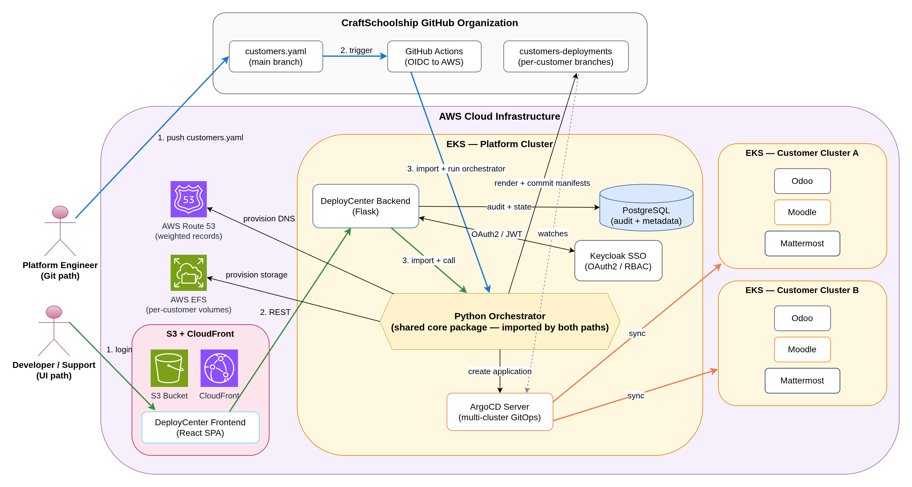

## Overview

### What it is
DeployCenter provisions customer applications on multi-region EKS clusters. It supports Odoo, Moodle, and Mattermost today, and a new app starts with a template set rather than a new deployment workflow.

Infrastructure changes can go through `customers.yaml`. App deploys can also go through a React dashboard that talks to Flask. Both paths call the same Python orchestration package. I built all three pieces: the orchestrator, the Flask API, and the React dashboard.

### Why it exists
Deploying one customer app used to take about 15 minutes. An engineer wrote Kubernetes manifests, filled Helm values, created EFS volumes, added Route53 records in the AWS console, then committed generated files to Git. A typo in any step could break the deploy.

We needed a Git path for batch changes and a dashboard path for day-to-day app deploys, without giving everyone write access to the deployment repo.

### Outcome

:::tip Key Results
- Per-app deploy time dropped from 15 minutes to 3
- 20+ customers run across 3 AWS regions
- Odoo, Moodle, and Mattermost share one deployment engine; a new app is a template set, not new code
- Git pushes and dashboard actions produce the same manifests
- Developers deploy behind Keycloak roles, without repo write access
:::

---

## Background

The first version used one repo, `customers.yaml`, a Python script, and a GitHub Actions workflow. Engineers edited YAML on `main`. The workflow rendered manifests, created AWS resources, and committed generated files to per-customer branches. ArgoCD synced those branches to the target clusters.

That flow worked for infrastructure-heavy changes. It slowed down developers who needed to deploy customer apps but did not need repo write access. Training each person on Git conflicts, YAML mistakes, and CI failures cost more time than the deployment itself.

I built DeployCenter on top of the existing automation. The Python script became an importable package. Flask added auth, validation, rollback coordination, and a PostgreSQL audit trail. React gave the rest of the team a controlled deploy flow. Keycloak roles decide who can view, deploy, edit templates, or manage customers.

The Git path still exists for batch work, and the dashboard handles one-off deploys. Both routes share one renderer and one provisioning path.

---

## Architecture

### Architecture Diagram

### Deploy Flow

Both entry points call the same Python orchestration core.

**Git-driven path:** an engineer edits `customers.yaml` on `main`. GitHub Actions assumes an AWS role through OIDC, runs the orchestrator, renders manifests, provisions AWS resources, and pushes generated files to customer branches. ArgoCD detects the branch update and syncs the target cluster.

**Dashboard path:** a user signs in through Keycloak, chooses a customer and app template, fills region-specific values, and clicks deploy. Flask validates the request, calls the same orchestrator, and writes audit records to PostgreSQL.

:::info Key Components
React dashboard (S3 + CloudFront) -> Flask API (EKS) -> Python orchestrator -> ArgoCD (multi-cluster) -> EKS clusters -> AWS (EFS, Route53, S3)

Parallel path: GitHub Actions -> same Python orchestrator -> same downstream targets
:::

---

## Implementation Highlights

- The orchestration core renders manifests and Helm values from Jinja2 templates with custom `[[ ]]` delimiters to avoid clashing with Helm syntax, and treats AWS, GitHub, and ArgoCD operations as idempotent: read before create, write only when content changes, exponential backoff on ArgoCD 429s.
- Two GitHub Actions workflows drive the Git path: one renders and provisions when `customers.yaml` changes, the other merges `main` into customer branches so template updates reach existing customers without re-editing config.
- Each customer maps to one AWS region (US-WEST-2, EU-SOUTH-2, EU-WEST-3). The orchestrator caches Boto3 clients per region, and Route53 weighted records distribute traffic across regional endpoints.
- Flask validates Keycloak JWTs, stores customers, deployments, and audit records in PostgreSQL, and coordinates rollback when a deploy fails mid-flight.

---

## Key Challenges & Solutions

### Challenge 1: Two Entry Points Without Two Deploy Systems

**Problem:** We still needed `customers.yaml` for batch changes, but developers needed a UI for day-to-day deploys. Two separate implementations would force every template change, AWS fix, and ArgoCD update through two code paths.

**Solution:** I moved the deployment logic into a Python package with no Flask or GitHub Actions dependency. The CI workflow imports it, and the Flask backend imports it. Both call the same `deploy_customer_app()` entrypoint with the same input shape.

:::success Result
Git pushes and dashboard actions use the same renderer, provisioning code, and ArgoCD calls. Template changes ship once.
:::

---

### Challenge 2: Coordinating AWS, GitHub, and ArgoCD Without Orphans

**Problem:** One deployment touches EFS, Route53, Git commits, ArgoCD projects, and ArgoCD applications. A mid-flight failure could leave EFS volumes, DNS records, or commits that pointed at infrastructure the platform never finished creating.

**Solution:** I wrapped the sequence in a coordinator that records each created resource. External calls use retry logic for transient failures. If a later step fails, the coordinator walks the created-resource list backward, deletes what it created, reverts the Git commit, and removes the partial ArgoCD app.

:::success Result
Failed deploys no longer leave manual cleanup work. The team can retry from GitHub Actions or the dashboard.
:::

---

### Challenge 3: Standard Templates With Customer Overrides

**Problem:** Customers needed different values for the same app: replica counts, SMTP settings, storage classes, domains, and feature flags. A template fork per customer would make upgrades painful.

**Solution:** I designed templates as base files plus customer overrides. The base template contains the standard Helm values and manifests. `customers.yaml` or the dashboard provides only the customer-specific keys. The renderer merges those keys into the base before writing the final manifests.

:::success Result
Three base app templates serve 20+ customers. A new customer needs a YAML entry or dashboard submission, not a template fork.
:::
