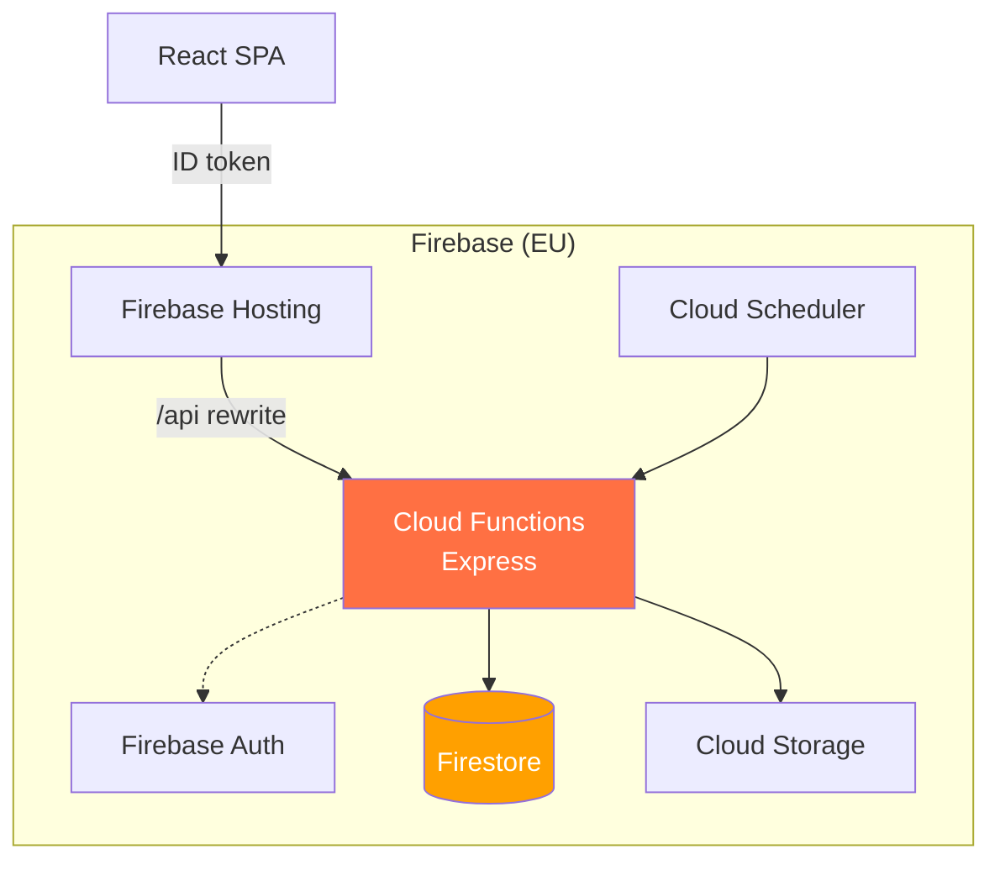

## Overview

### What it is
An HR platform for a manufacturing client, delivered under a UNIDO Industry 4.0 program. It replaces the paper evaluation form FOR-029-EN-A and the Excel files around it with a full digital cycle: self-assessment, manager review, HR validation, e-signatures, and an archived PDF report. Training plans, leave requests, and attendance tracking ship as optional modules behind configuration flags.

The platform runs on Firebase end to end. Hosting serves the React SPA and rewrites `/api/**` to an Express app on Cloud Functions Gen 2. Firestore holds the data, Firebase Auth carries identity with a role custom claim, Cloud Storage archives the PDF reports, and Cloud Scheduler drives the daily reminder job.

Three engineers built it. I was the lead contributor with about 380 of the 645 commits: the evaluation workflow features, the UI rework, the French/English/Arabic i18n, the PDF report engine, the 1,400-case test campaign, and the CI/CD pipelines. Claude Code was part of my toolchain throughout, for test generation, refactors, and review passes; every change still landed through PR review.

### Why it exists
The client ran HR on paper and scattered spreadsheets. An evaluation cycle meant printing a form per employee, scoring by hand, chasing signatures across the plant, and filing the result in a cabinet. Documents got lost, cycles dragged, and HR had no way to answer questions like "what share of the workforce has a closed evaluation this year."

We shipped it as a managed SaaS on serverless components: nothing for a single-plant client to patch, scale, or restore, and a bill that tracks usage. Employee evaluations are personal data under a European program, so every resource is pinned to EU regions and CI refuses a deploy that would place a function outside the EU. The contract committed to the evaluation module alone while the spec described four modules, so training, leave, and attendance sit behind flags and each deployment turns on what the client bought.

### Outcome

:::tip Key Results
- Replaced the client's paper evaluation cycle end to end: state machine, e-signatures, HR validation, and an archived PDF per approved evaluation
- About 120 REST endpoints on serverless Firebase, pinned to EU regions; Firestore rules deny client writes, so the audited API is the only write path
- Scoring engine enforces the group HR standard: objective results capped at 150, weights that must sum to 100%, 3 to 6 objectives per evaluation
- French, English, and Arabic UI with full right-to-left support
- 1,400+ test cases across 51 files, run on every PR
- PR preview channels, auto-deploy to staging, and production gated behind manual approval
:::

---

## Architecture

:::info Architecture Overview
The SPA signs in through the Firebase Auth SDK and sends an ID token with every request. Hosting rewrites `/api/**` to the Express app, where middleware verifies the token, reads the role claim, and loads the caller's profile before any handler runs. Handlers use the Admin SDK; Firestore and Storage rules block direct client access, so every mutation flows through the audited API. Downloads go through signed URLs with a 15-minute TTL, and a scheduled function sweeps for stale evaluations every 24 hours.
:::

---

## Implementation Highlights

- A scheduled function finds evaluations stuck in each workflow state past a configurable threshold and reminds the employee, the evaluator, or HR, with a cooldown against repeat pings.
- Training plans follow a tripartite chain: manager approves relevance, HR approves budget, the employee acknowledges. The generic update endpoint refuses status jumps so every transition passes its dedicated guard, and a cold-review job flags trainings completed 3 to 6 months ago for an effectiveness rating in the next evaluation.
- Leave balances follow the Tunisian labor code (18 days per year, 9-day carryover cap). HR approval deducts the balance and writes the matching attendance codes into the monthly grid, skipping weekends.
- Roles live as Firebase Auth custom claims mirrored in the user documents; org-chart scoping keeps managers inside their own reporting line, and an immutable audit log records each privileged action with a structured old/new diff, the actor, and the client IP.
- Merges to main auto-deploy to staging, production requires a manual run gated by a GitHub Environment, and every PR gets a preview channel. Operational workflows (demo seeding, data backfills) demand a typed confirmation token, and the deploy pipeline verifies region placement before shipping.

---

## Key Challenges & Solutions

### Challenge 1: Relational HR Workflows on a Document Store

**Problem:** Evaluations reference employees, evaluators, and a competency catalog; managers query their queue and HR queries campaign-wide stats. Firestore offers no joins, and a normalized model would mean N+1 reads per list view. Worse, referencing live employee documents would silently rewrite history: change someone's team and every past evaluation would follow.

**Solution:** I modeled around access paths instead of entities. Each evaluation embeds a snapshot of the employee's profile at creation, so history reads one document and stays faithful to the interview date. Composite indexes back the two hot queries: employee history ordered by creation, and the manager queue filtered by status. Notifications live as a per-user subcollection, so the recipient is the hierarchy rather than a duplicated field, and a collection-group index lets the reminder job check its cooldown without scanning.

:::success Result
List views read a fixed number of documents regardless of org size, and approved evaluations stay historically accurate through reorganizations.
:::

---

### Challenge 2: Turning a Paper Form into Rules a Server Enforces

**Problem:** The paper process accepted anything: objective weights that never summed to 100%, scores past the cap, evaluations signed before the employee saw them, edits after signing. A digital copy without enforcement would have carried those habits over.

**Solution:** I encoded the form's rules as server-side guards. The state machine refuses out-of-order transitions. The scoring module caps objective results at 150 and rejects weight totals other than 100%. The objective-count rule (3 to 6, minimum one for production staff) blocks creation and update alike. Signatures are write-once, approved evaluations are read-only, and the one escape hatch, an admin unlock, writes an audit entry. Each rule carries the requirement ID from the spec (EVAL-001 through EVAL-012), so commits trace back to the clause that demanded them.

:::success Result
HR validates evaluations instead of policing them. The client audits the delivery against the spec by grepping requirement IDs through the git history.
:::

---

### Challenge 3: A Faithful PDF of the Group Form in PDFKit

**Problem:** HR files the evaluation report, so the generated PDF had to match the form their group headquarters owns. PDFKit offers no table layout: long French labels wrapped across row borders, the draft watermark covered content, and signature blocks split across page breaks.

**Solution:** I built the layout engine around measurement before drawing. Each row measures its wrapped text and sizes itself first, so borders follow content. The BROUILLON watermark draws as a rotated page background and shrinks to fit A4 instead of bleeding off it. The signature block moves as one unit to the next page when it would split. Signatures embed as PNGs decoded from the data URLs captured in the app.

:::success Result
Approved evaluations archive as versioned PDFs on Cloud Storage that HR files in place of the paper form. Drafts stream with the watermark so nobody mistakes a preview for a signed report.
:::
