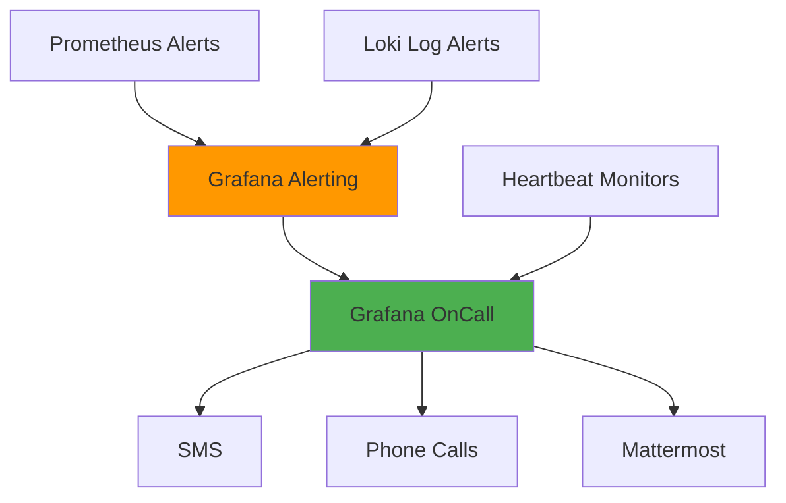

## Overview

### What it is
Complete observability platform for monitoring multiple Kubernetes clusters with metrics, logs, dashboards, and alerting. Centralized stack providing unified visibility into all cluster and application health.

### Why it exists
Teams lacked visibility into cluster health and application issues. Manual log searching across clusters was time-consuming. No centralized alerting meant incidents discovered late. Needed comprehensive monitoring to reduce downtime and improve incident response.

### Outcome

:::tip Key Results
- **50% faster incident response** - Improved MTTA (Mean Time to Acknowledge) and MTTR (Mean Time to Resolve)
- **Reduced downtime** - Proactive alerts catch issues before user impact
- **Centralized observability** - Single pane of glass for all clusters
- **Automated oncall rotation** - Structured incident response with schedules and escalations
:::

---

## Architecture

### Alerting Flow

:::info Alert Flow
**Prometheus** and **Loki** send alerts to **Grafana Alerting**. **Grafana OnCall** routes alerts based on severity to SMS, calls, or Mattermost. **Heartbeat monitors** ensure monitoring systems are alive. **Oncall schedules** define who receives alerts with automatic escalation.
:::

---

## Tech Stack

**Monitoring:** Prometheus, Grafana, Loki, Promtail, Metrics Server, Kube State Metrics  
**Alerting:** Grafana OnCall (SMS, Phone, Mattermost)  
**Storage:** AWS S3  
**IaC:** Terraform  
**SSO:** Keycloak

---

## Implementation Setup

### Infrastructure Provisioning (Terraform)
Updated existing Terraform code managing clusters to include:
- **Metrics Server:** Kubernetes resource metrics for HPA and kubectl top
- **Kube State Metrics:** Cluster object metrics (pods, deployments, nodes)
- **Prometheus:** Metrics collection and storage with retention policies
- **Grafana:** Visualization and dashboarding platform
- **Loki:** Log aggregation system
- **Promtail:** Log shipping agent deployed as DaemonSet
- **AWS IAM roles:** Permissions for S3 access
- **S3 buckets:** Log storage with lifecycle policies

### Loki Configuration
Configured for long-term log storage:
- **S3 backend:** Store logs in AWS S3 for cost-effective retention
- **Retention period:** Configured retention policies for log lifecycle
- **Chunk storage:** Optimized chunk size and compression
- **Index configuration:** Balanced query performance and storage cost

### Grafana Dashboards
Built custom dashboards:
- **Application logs:** Query and filter logs by namespace, pod, container
- **Cluster components:** Monitor control plane, nodes, etcd, API server health
- **Resource usage:** CPU, memory, disk, network across clusters
- **Application metrics:** Request rates, latencies, error rates per service

### Alerting Configuration
Configured multi-channel alerting:
- **SMS alerts:** Critical incidents requiring immediate attention
- **Phone calls:** Severe issues with automatic escalation
- **Mattermost:** Team notifications for warnings and informational alerts
- **Alert rules:** Prometheus and Loki queries triggering on thresholds
- **Severity levels:** Critical, warning, info with different routing

### Keycloak SSO Integration
Integrated company identity provider:
- **OAuth2 configuration:** Grafana authenticates via Keycloak
- **Role mapping:** Sync teams and permissions from Keycloak groups
- **Single sign-on:** Colleagues access Grafana with company credentials

### Grafana OnCall Setup
Implemented incident management:
- **Oncall schedules:** Weekly rotation with primary and backup engineers
- **Escalation policies:** Auto-escalate if no acknowledgment within SLA
- **Heartbeat monitors:** Verify monitoring systems are functioning
- **Integrations:** Connect with Prometheus, Loki, and notification channels
- **Runbooks:** Documented response procedures per alert type

### Documentation
Created operational documentation:
- **Alert runbooks:** Step-by-step resolution procedures for each alert
- **Oncall handbook:** How to handle incidents during oncall shifts
- **Dashboard guides:** How to use dashboards for troubleshooting
- **System architecture:** Overview of monitoring stack components

---

## Key Challenges & Solutions

### Challenge 1: Storing Logs Cost-Effectively at Scale

**Problem:** Kubernetes clusters generate massive log volumes. Storing all logs in Loki's local storage became expensive and unmanageable as data grew.

**Solution:** Configured Loki to use S3 as storage backend. Implemented retention policies to move older logs to cheaper S3 storage tiers. Set up lifecycle rules to automatically delete logs after retention period expires.

:::success Result
Reduced log storage costs by 70% while maintaining queryability for recent logs and long-term retention for compliance
:::

---

### Challenge 2: Reducing Alert Fatigue

**Problem:** Initial alert configuration generated too many notifications. Engineers received alerts for non-critical issues, causing important alerts to be ignored.

**Solution:** Refined alert thresholds based on actual incident patterns. Implemented severity levels with different notification channels. Critical alerts go to phone/SMS, warnings to Mattermost only. Added silence rules for known maintenance windows.

:::success Result
Reduced alert volume by 60% while maintaining coverage of real issues. Oncall engineers respond faster to genuine incidents
:::

---

### Challenge 3: Ensuring Monitoring System Reliability

**Problem:** Monitoring system itself could fail silently. If Prometheus stopped scraping or Loki stopped receiving logs, teams wouldn't know until trying to debug an incident.

**Solution:** Implemented heartbeat monitors in Grafana OnCall. Services send periodic heartbeats. If heartbeat missed, alert fires indicating monitoring component failure. Added meta-monitoring dashboards showing health of monitoring stack itself.

:::success Result
Monitoring system failures detected immediately. Team can fix observability issues before they impact incident response
:::