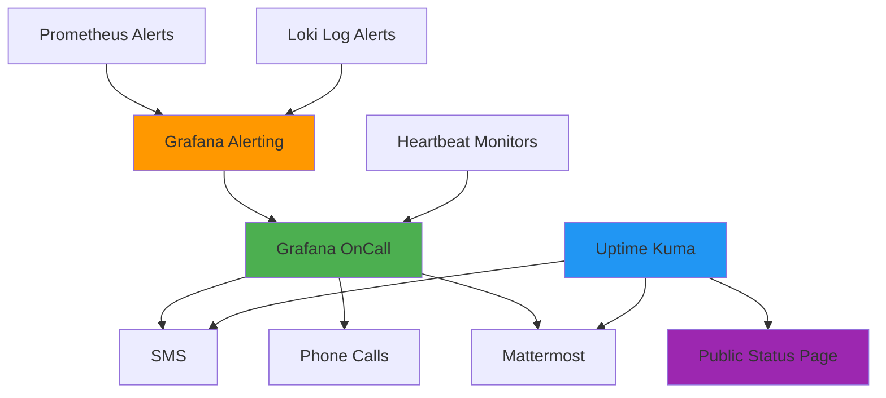

## Overview

### What it is
A production observability stack for Kubernetes workloads. Prometheus collects metrics, Loki stores logs, Jaeger traces service calls, Kiali shows Istio traffic, and Grafana ties the signals into dashboards and alerts.

I also deployed Uptime Kuma on a separate AWS Lightsail instance. It checks each customer HTTPS domain from outside the EKS account and hosts a public status page customers can use during incidents.

### Why it exists
Engineers had to jump between clusters, pods, and shell sessions to answer basic incident questions. Logs lived behind `kubectl logs`, alerts fired from different places, and customer-facing outages often reached us through support tickets first.

I wanted one dashboard, one alert path, and one external check that sees what customers see.

### Outcome

:::tip Key Results
- MTTA and MTTR cut by 50%
- Prometheus and Loki feed one Grafana per environment
- External HTTPS checks from a separate Lightsail instance
- Public Uptime Kuma status page for customer-facing incidents
- Runbook attached to each alert
- Lightweight on-call rotation with escalation for unacknowledged alerts
:::

---

## Architecture

### Alerting Flow

```mermaid
graph TD
    A[Prometheus Alerts] --> B[Grafana Alerting]
    C[Loki Log Alerts] --> B

    B --> D[Grafana OnCall]

    D --> E[SMS]
    D --> F[Phone Calls]
    D --> G[Mattermost]

    H[Heartbeat Monitors] --> D

    K[Uptime Kuma] --> E
    K --> G
    K --> P[Public Status Page]

    style B fill:#FF9800
    style D fill:#4CAF50
    style K fill:#2196F3
    style P fill:#9C27B0
```

:::info Alert Flow
Prometheus and Loki send in-cluster alerts into Grafana Alerting. Grafana OnCall routes them by severity to phone, SMS, or Mattermost. Each alert includes a runbook link, so the responder opens the alert and sees the first action to take.

Uptime Kuma runs on its own alert path. It sends failed HTTPS checks to Mattermost and SMS without depending on Grafana, and it serves the public status page from the same Lightsail instance. Heartbeat monitors cover the in-cluster monitoring path.
:::

---

## Tech Stack

**Monitoring:** Prometheus, Grafana, Loki, Promtail, Metrics Server, Kube State Metrics  
**Tracing:** Jaeger  
**Ingress / mesh metrics:** Nginx Ingress Controller, Istio, Kiali  
**External probes:** Uptime Kuma on AWS Lightsail  
**Alerting:** Grafana OnCall, SMS, phone calls, Mattermost  
**Storage:** AWS S3  
**IaC:** Terraform  
**SSO:** Keycloak

---

## Implementation Setup

### Infrastructure Provisioning
I extended the existing Terraform stack with:
- Metrics Server for HPA data and `kubectl top`
- Kube State Metrics for pods, deployments, nodes, and other Kubernetes objects
- Prometheus with retention sized from ingest volume
- Grafana for dashboards, alert rules, and OnCall
- Loki for log aggregation
- Promtail as a DaemonSet on each node
- IAM roles for S3 access through IRSA
- S3 buckets with lifecycle rules for Loki retention
- Lightsail instance, firewall rules, and DNS for Uptime Kuma

### Loki Configuration
- S3 backend for chunks and indexes
- Chunk size and compression tuned against real log volume
- Retention aligned with the compliance window
- Index period chosen to keep recent queries fast while controlling long-tail storage cost

### Grafana Dashboards
- Application logs by namespace, pod, and container
- Cluster health for nodes, etcd, API server, and control-plane components
- Resource usage by cluster: CPU, memory, disk, and network
- Application metrics: request rate, latency, and error rate per service
- Ingress traffic: per-host RPS, p95 latency, and 4xx/5xx ratios
- Service mesh traffic between workloads

### Nginx Ingress Controller Metrics
The Nginx Ingress Controller exposes Prometheus metrics on `/metrics`, and a `ServiceMonitor` scrapes it. I built dashboards around the `ingress`, `host`, and `status` labels, so engineers can inspect one customer domain without digging through aggregate traffic. Alerts fire on sustained 5xx ratios and p95 latency above the threshold for each app.

### Istio Metrics
Prometheus scrapes Envoy sidecars and istiod. Grafana dashboards show request rates, success ratios, and latency between workloads. Kiali adds the service graph on top of the same mesh signals.

### Distributed Tracing
Envoy sidecars emit spans for inter-service calls. Jaeger collects the spans and lets engineers search by trace ID, service, or operation. During an incident, a responder can open one trace and see which hop burned the latency budget.

### Service Mesh Topology
Kiali reads Istio config and Prometheus metrics to render the workload graph. It validates `VirtualService` and `DestinationRule` objects against the running mesh, flags traffic routing issues, and links graph edges to Jaeger traces. Keycloak protects Kiali with the same SSO flow as Grafana.

### External Uptime Probes
Uptime Kuma runs on a dedicated Lightsail instance outside the EKS account and cluster network. It checks each customer HTTPS domain on a fixed interval, validates the status code, matches a known response string, and watches certificate expiry.

The separate network path catches edge failures that in-cluster metrics can miss. If DNS breaks, a load balancer routes traffic to the wrong target, or a TLS certificate expires, Uptime Kuma catches the customer-facing failure and alerts through Mattermost and SMS. Certificate-expiry warnings fire 14 days before expiry.

The same instance hosts a public status page, so customers can check service health during an incident without waiting for someone on the team to reply.

### Alerting Configuration
- Critical alerts page phone and SMS
- Warning alerts post to Mattermost
- Info alerts collect in a low-noise feed
- Prometheus and Loki own in-cluster alert rules
- Uptime Kuma owns external HTTPS alert rules
- Each alert links to a runbook
- Planned maintenance uses silence windows

### Keycloak SSO
- Keycloak backs Grafana OAuth2
- Keycloak groups mapped to Grafana org roles
- One login covers Grafana and Grafana OnCall

### Grafana OnCall
- Primary and backup rotation for on-call coverage
- Escalation when an alert passes its acknowledgement SLA
- Heartbeats for Prometheus, Loki, and Promtail
- Integrations for Prometheus, Loki, and Mattermost

### Documentation
- Per-alert runbooks with commands, dashboards, owners, and rollback notes
- On-call notes for handover and escalation
- Dashboard guides for common troubleshooting paths
- Architecture overview for the monitoring stack

---

## Key Challenges & Solutions

### Challenge 1: Log Storage Cost at Cluster Scale

**Problem:** Kubernetes logs outgrew local disk within the first month. Keeping Loki storage on cluster volumes would have raised cost and made retention harder to enforce.

**Solution:** I moved Loki chunks and indexes to S3. Bucket lifecycle rules transition older objects to cheaper storage classes and delete them after the retention window. I tuned chunk size and index periods from query patterns instead of keeping Loki defaults.

:::success Result
Log storage costs dropped 70%. Recent logs stay fast to query, and older logs age out through S3 lifecycle rules.
:::

---

### Challenge 2: Alert Fatigue

**Problem:** The first alert set fired on spikes that did not affect customers. Engineers muted Mattermost, and real incidents had to compete with noise.

**Solution:** I rebuilt thresholds from the previous quarter of incidents. Critical alerts now page by phone and SMS, warnings go to Mattermost, and info alerts collect in a lower-priority feed. Planned work uses silence windows. Each alert includes a runbook, so responders spend less time asking what the alert means.

:::success Result
Alert volume fell 60%. The remaining pages map closer to customer impact, and responders reach the right dashboard faster.
:::

---

### Challenge 3: Detecting Monitoring Failures

**Problem:** A broken monitoring pipeline can look like a quiet system. If Prometheus stops scraping or Promtail stops shipping logs, engineers may miss the next outage.

**Solution:** I added Grafana OnCall heartbeats for Prometheus, Loki, and Promtail log delivery. A missed heartbeat opens its own alert. A meta-dashboard shows the health of the monitoring components themselves.

:::success Result
Monitoring failures now page the on-call rotation like product incidents.
:::

---

### Challenge 4: Seeing What Customers See

**Problem:** In-cluster monitoring only sees the cluster side. DNS mistakes, load balancer routing issues, and expired edge certificates can break the app for customers while Prometheus still reports green services.

**Solution:** I deployed Uptime Kuma on Lightsail, outside the EKS account and cluster networking. It probes each customer HTTPS domain, checks the response, and alerts through a separate Mattermost and SMS path. The public status page runs from the same instance.

:::success Result
Edge failures now page the on-call rotation within a probe interval. Customers can check the public status page instead of waiting for us to confirm an incident.
:::
