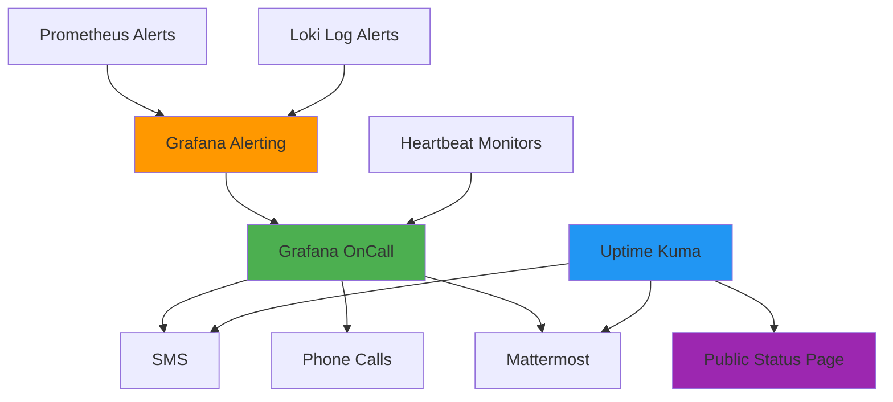

## Overview

### What it is
A monitoring stack that covers in-cluster signals (Prometheus metrics, Loki logs, Grafana dashboards, OnCall alerting) and a separate external prober running Uptime Kuma on AWS Lightsail. The Lightsail box checks each customer's SSL domain over HTTPS the way a browser would, hosts a public status page customers can read during incidents, and runs on its own alert path independent of Grafana.

### Why it exists
Engineers had no consolidated view of cluster or app health. Searching logs meant SSHing into clusters and running `kubectl logs` per pod. Alerts were ad-hoc, so incidents surfaced when a customer complained rather than when an SLO breached.

### Outcome

:::tip Key Results
- Incident response 50% faster (MTTA and MTTR halved)
- One Grafana per environment, fed by Prometheus and Loki
- External SSL probes from outside AWS catch outages that look healthy from inside the cluster
- Public status page on Uptime Kuma so customers can see live service health themselves
- Every alert links to its own runbook so responders know how to act on it
- Oncall rotation with auto-escalation when an alert sits unacknowledged
:::

---

## Architecture

### Alerting Flow

```mermaid
graph TD
    A[Prometheus Alerts] --> B[Grafana Alerting]
    C[Loki Log Alerts] --> B

    B --> D[Grafana OnCall]

    D --> E[SMS]
    D --> F[Phone Calls]
    D --> G[Mattermost]

    H[Heartbeat Monitors] --> D

    K[Uptime Kuma] --> E
    K --> G
    K --> P[Public Status Page]

    style B fill:#FF9800
    style D fill:#4CAF50
    style K fill:#2196F3
    style P fill:#9C27B0
```

:::info Alert Flow
Prometheus and Loki forward alerts to Grafana Alerting, which hands them to Grafana OnCall for routing to SMS, phone, or Mattermost by severity. Each alert points at its own runbook so the responder knows how to act on it. Uptime Kuma runs on its own track: failures alert straight to Mattermost and SMS, with no dependency on Grafana, and the same instance serves a public status page for customers. Heartbeat monitors confirm the in-cluster path is alive.
:::

---

## Tech Stack

**Monitoring:** Prometheus, Grafana, Loki, Promtail, Metrics Server, Kube State Metrics  
**Ingress / mesh metrics:** Nginx Ingress Controller, Istio (Envoy stats + istiod)  
**External probes:** Uptime Kuma on AWS Lightsail  
**Alerting:** Grafana OnCall (SMS, Phone, Mattermost)  
**Storage:** AWS S3  
**IaC:** Terraform  
**SSO:** Keycloak

---

## Implementation Setup

### Infrastructure Provisioning (Terraform)
Extended the existing cluster Terraform to add:
- Metrics Server for HPA and `kubectl top`
- Kube State Metrics for cluster-object signals (pods, deployments, nodes)
- Prometheus with retention configured against actual ingest rate
- Grafana for dashboards and alerting
- Loki for log aggregation
- Promtail as a DaemonSet shipping logs from each node
- IAM roles for S3 access via IRSA
- S3 buckets with lifecycle rules for log retention
- A Lightsail instance, security group, and DNS record for the external prober

### Loki Configuration
- S3 backend for chunks and indexes (chunk size and compression tuned for our log volume)
- Retention aligned with the team's compliance window
- Index period balanced for query latency on the last 7 days against storage cost on the long tail

### Grafana Dashboards
- Application logs filterable by namespace, pod, and container
- Cluster components: control plane, nodes, etcd, API server
- Resource usage: CPU, memory, disk, network per cluster
- Application metrics: request rates, latencies, error rates per service
- Ingress traffic: per-host RPS, p95 latency, and 4xx/5xx ratios from the Nginx Ingress Controller
- Service mesh: request volume between workloads and mTLS coverage from Istio

### Nginx Ingress Controller Metrics
The Nginx Ingress Controller exposes Prometheus metrics on `/metrics`. A `ServiceMonitor` scrapes it. Dashboards key off `ingress`, `host`, and `status` labels, so we see traffic per customer domain rather than aggregate noise. Alerts trigger on sustained 5xx ratio per ingress and on p95 latency above per-app thresholds.

### Istio Metrics
Prometheus scrapes Istio's Envoy sidecars and istiod for service-mesh telemetry. Dashboards show request rates, success ratios, and latency between workloads, and alerts fire when inter-service errors or mTLS failures cross threshold.

### External Uptime Probes (Uptime Kuma on Lightsail)
Uptime Kuma runs on a small Lightsail instance outside the EKS account. It hits each customer's SSL domain over HTTPS on a fixed interval and validates the status code, a known body string, and certificate expiry. The Lightsail location is the point: if EKS, the cluster's networking, or the AWS region itself goes down, the prober keeps running.

The instance is its own thing, deliberately separate from the Grafana stack. It has its own dashboard for the team and serves a public status page that customers can check during incidents. When a probe fails, Uptime Kuma alerts straight to Mattermost and SMS, on a path that doesn't touch Grafana, so a region-level outage that takes the in-cluster alerting down doesn't take the page out down with it. Certificate-expiry warnings fire 14 days out.

### Alerting Configuration
- Severity tiers route to different channels: critical pages phone + SMS, warning posts to Mattermost, info goes to a quieter feed
- Alert rules live in Prometheus and Loki for in-cluster signals; Uptime Kuma owns its own rules for external probes
- Every alert has a runbook attached, so a responder paged at 3am has the resolution steps in front of them rather than digging through the wiki
- Silence windows for planned maintenance

### Keycloak SSO Integration
- Grafana OAuth2 backed by Keycloak
- Keycloak group mappings sync to Grafana org roles
- One login covers Grafana, OnCall, and the Loki UI

### Grafana OnCall Setup
- Weekly rotation with primary and backup
- Auto-escalation when an alert sits unacknowledged past the SLA
- Heartbeat monitors covering Prometheus, Loki, and Promtail
- Integrations wired to Prometheus, Loki, and Mattermost

### Documentation
- Per-alert runbooks so responders know the resolution steps for whatever fired
- Oncall handbook covering shift handover, escalation, and common pitfalls
- Dashboard guides for the most-used troubleshooting flows
- Architecture overview of the monitoring stack itself

---

## Key Challenges & Solutions

### Challenge 1: Log Storage Cost at Cluster Scale

**Problem:** Kubernetes clusters generate log volume that outgrew any reasonable local-disk plan. Loki's default storage was unsustainable within the first month.

**Solution:** I switched Loki's backend to S3 for both chunks and indexes. Lifecycle rules on the bucket transition older objects to cheaper storage classes and delete them after the retention window. Index period and chunk size were tuned against actual query patterns rather than defaults.

:::success Result
Log storage costs dropped 70%. Recent logs stay fast to query; older logs sit in cold storage until retention lapses them.
:::

---

### Challenge 2: Alert Fatigue

**Problem:** The first alert pass fired on every spike. Engineers muted Mattermost and started ignoring genuine incidents.

**Solution:** I rebuilt thresholds against the previous quarter's incident data. Severity tiers now route differently: critical pages a phone, warning posts to Mattermost, info collects in a low-noise channel. Maintenance windows get pre-scheduled silence rules instead of ad-hoc mutes. Pairing each alert with a runbook cut down on "what does this even mean" pings, since responders now jump straight to the resolution steps.

:::success Result
Alert volume fell 60%. The pages that do fire correlate with real customer-affecting incidents, and time-to-resolution on those pages improved.
:::

---

### Challenge 3: Detecting Monitoring Failures

**Problem:** A silent monitoring failure looks identical to a healthy system. If Prometheus stopped scraping or Promtail wedged, no one would notice until an actual outage went undetected.

**Solution:** Heartbeat monitors in Grafana OnCall. Each component (Prometheus, Loki, Promtail's log delivery) sends a periodic heartbeat. A missed heartbeat fires its own alert. A meta-dashboard shows live state for every monitoring component.

:::success Result
Monitoring outages now page the team rather than going unnoticed.
:::

---

### Challenge 4: Outages from the User's Perspective

**Problem:** In-cluster monitoring only sees what the cluster sees. If a load balancer is misrouting traffic, a DNS record is wrong, or a TLS certificate has expired at the edge, Prometheus reports green while customers can't reach the app.

**Solution:** I deployed Uptime Kuma on a Lightsail instance outside the EKS account and its networking. It hits each customer's SSL domain over HTTPS the way a browser would, on a fixed schedule, and validates the response code, a known body string, and certificate validity. Failures alert straight to Mattermost and SMS on a path that doesn't touch Grafana, so a region-level outage that takes the in-cluster stack down still gets a page out. The same instance hosts a public status page customers can check on their own.

:::success Result
Edge failures (load balancer, DNS, TLS) now page the team within a probe interval instead of after a customer reports them. Customers also see service health on the public status page without needing to ask support.
:::
