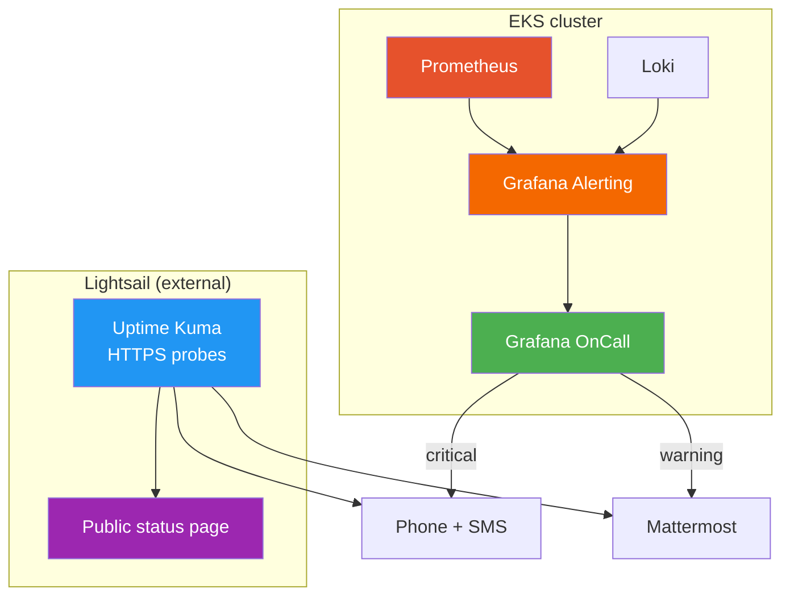

## Overview

### What it is
A production observability stack for Kubernetes workloads. I built it end to end: Prometheus collects metrics, Loki stores logs, Jaeger traces service calls, Kiali shows Istio traffic, and Grafana ties the signals into dashboards and alerts.

I also deployed Uptime Kuma on a separate AWS Lightsail instance. It checks each customer HTTPS domain from outside the EKS account and hosts a public status page customers can use during incidents.

### Why it exists
Engineers had to jump between clusters, pods, and shell sessions to answer basic incident questions. Logs lived behind `kubectl logs`, alerts fired from different places, and customer-facing outages often reached us through support tickets first.

I wanted one dashboard, one alert path, and one external check that sees what customers see.

### Outcome

:::tip Key Results
- MTTA and MTTR cut by 50%
- Log storage cost down 70% after moving Loki chunks and indexes to S3
- Alert volume down 60% after rebuilding thresholds from a quarter of incident history
- External HTTPS probes and a public status page that keep working when the cluster is sick
- A runbook on every alert, and an on-call rotation with escalation
:::

---

## Architecture

### Alerting Flow

```mermaid
graph TD
    subgraph EKS ["EKS cluster"]
        P[Prometheus] --> G[Grafana Alerting]
        L[Loki] --> G
        G --> OC[Grafana OnCall]
    end

    OC -->|critical| PAGE[Phone + SMS]
    OC -->|warning| MM[Mattermost]

    subgraph LS ["Lightsail (external)"]
        UK[Uptime Kuma<br/>HTTPS probes] --> SP[Public status page]
    end

    UK --> PAGE
    UK --> MM

    style P fill:#E6522C,color:#fff
    style G fill:#F46800,color:#fff
    style OC fill:#4CAF50,color:#fff
    style UK fill:#2196F3,color:#fff
    style SP fill:#9C27B0,color:#fff
```

:::info Alert Flow
Prometheus and Loki send in-cluster alerts into Grafana Alerting. Grafana OnCall routes them by severity to phone, SMS, or Mattermost. Each alert includes a runbook link, so the responder opens the alert and sees the first action to take.

Uptime Kuma runs on its own alert path. It sends failed HTTPS checks to Mattermost and SMS without depending on Grafana, and it serves the public status page from the same Lightsail instance. Heartbeat monitors cover the in-cluster monitoring path.
:::

---

## Implementation Highlights

- Terraform provisions the whole stack: Prometheus, Grafana, Loki with Promtail DaemonSets, Metrics Server, Kube State Metrics, IRSA roles for S3 access, and the Lightsail instance for Uptime Kuma.
- Dashboards cover cluster health, per-service request rate and latency, and ingress traffic by customer domain (per-host RPS, p95 latency, 4xx/5xx ratios). Kiali renders the Istio workload graph and links graph edges to Jaeger traces.
- Jaeger collects spans from Envoy sidecars, so a responder can open one trace and see which hop burned the latency budget.
- Keycloak backs Grafana OAuth2 with groups mapped to org roles. Grafana OnCall runs a primary/backup rotation with escalation past the acknowledgement SLA, and heartbeats page the rotation when Prometheus, Loki, or Promtail stop reporting.
- Each alert links to a runbook with commands, dashboards, owners, and rollback notes.

---

## Key Challenges & Solutions

### Challenge 1: Log Storage Cost at Cluster Scale

**Problem:** Kubernetes logs outgrew local disk within the first month. Keeping Loki storage on cluster volumes would have raised cost and made retention harder to enforce.

**Solution:** I moved Loki chunks and indexes to S3. Bucket lifecycle rules transition older objects to cheaper storage classes and delete them after the retention window. I tuned chunk size and index periods from query patterns instead of keeping Loki defaults.

:::success Result
Log storage costs dropped 70%. Recent logs stay fast to query, and older logs age out through S3 lifecycle rules.
:::

---

### Challenge 2: Alert Fatigue

**Problem:** The first alert set fired on spikes that did not affect customers. Engineers muted Mattermost, and real incidents had to compete with noise.

**Solution:** I rebuilt thresholds from the previous quarter of incidents. Critical alerts now page by phone and SMS, warnings go to Mattermost, and info alerts collect in a lower-priority feed. Planned work uses silence windows. Each alert includes a runbook, so responders spend less time asking what the alert means.

:::success Result
Alert volume fell 60%. The remaining pages map closer to customer impact, and responders reach the right dashboard faster.
:::

---

### Challenge 3: Seeing What Customers See

**Problem:** In-cluster monitoring only sees the cluster side. DNS mistakes, load balancer routing issues, and expired edge certificates can break the app for customers while Prometheus still reports green services.

**Solution:** I deployed Uptime Kuma on Lightsail, outside the EKS account and cluster networking. It probes each customer HTTPS domain, checks the response, and alerts through a separate Mattermost and SMS path. The public status page runs from the same instance.

:::success Result
Edge failures now page the on-call rotation within a probe interval. Customers can check the public status page instead of waiting for us to confirm an incident.
:::
