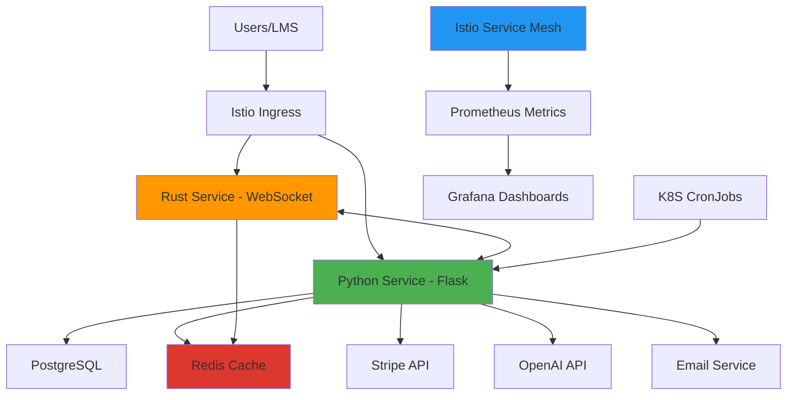

# QuizShip - Live Interactive Quiz Platform

## Overview

### What it is
Real-time quiz platform with live multiplayer sessions. Players join via WebSocket to compete in quizzes created by hosts. Python service handles business logic, Rust service manages real-time game sessions.

### Why it exists
Started as Rust WebSocket server for real-time quiz gameplay. Extended with Python microservice to add user management, payments, quiz storage, AI generation, and LMS integration while keeping performance-critical gameplay in Rust.

### Outcome

:::tip Key Results
- **Hybrid architecture** - Python for business logic, Rust for WebSocket game sessions
- **Stripe subscriptions** - Payment processing with automated quota enforcement
- **AI quiz generation** - OpenAI integration for automated content creation
- **LTI integration** - Deep linking with learning management systems
- **Production monitoring** - Istio metrics with Grafana dashboards and alerts
:::

---

## Architecture

:::info Architecture Overview
**Python Service** (Flask) handles auth, subscriptions, quiz library, analytics, AI generation, and LTI. **Redis** caches quiz data, API responses, and stores quiz game state. **Rust Service** manages real-time WebSocket game sessions with state in Redis. **CronJobs** run scheduled tasks. **Istio** provides metrics and observability.
:::

---

## Tech Stack

**Backend:** Python (Flask), Rust (WebSocket)  
**Database:** PostgreSQL, Redis  
**Integrations:** Stripe, OpenAI, LTI 1.3  
**Infrastructure:** Kubernetes, Helm, ArgoCD, Istio  
**Monitoring:** Prometheus, Grafana  
**CI/CD:** Docker, automated image builds

---

## Implementation Setup

### Python Service (Flask)
Built comprehensive backend:
- **Authentication:** JWT token generation and validation
- **User management:** Registration, profiles, role-based access
- **Subscriptions:** Stripe integration for payment processing and plan management
- **Quiz library:** CRUD operations for quiz storage and retrieval
- **Caching:** Redis for quiz data, API response caching, and game state storage
- **Analytics:** Track quiz sessions, user engagement, completion rates
- **Email service:** Transactional emails for notifications
- **AI quiz generation:** OpenAI API integration to generate questions from prompts
- **LTI integration:** LTI 1.3 provider for deep linking from LMS platforms
- **CLI commands:** Management commands for scheduled tasks

### Rust WebSocket Service
Real-time game server for live quiz sessions:
- **WebSocket connections:** Multiple concurrent quiz sessions
- **Game state management:** Store player scores, question timing in Redis
- **Communication with Python:** Validate users and check quotas
- **Analytics reporting:** Send session data to Python service

### Stripe Integration
- **Products and pricing:** Subscription tiers with different quiz limits
- **Webhook handlers:** Process subscription events, payment updates, cancellations
- **Quota management:** Enforce limits based on subscription tier
- **Subscription reconciliation:** Sync local database with Stripe state

### OpenAI Integration
- **Quiz generation:** Generate questions from text prompts
- **API integration:** Handle responses and parse content
- **Rate limiting:** Control usage per user and subscription tier

### LTI Integration
LTI 1.3 implementation:
- **Deep linking:** Launch quizzes from LMS course pages
- **OAuth flow:** LTI authentication and authorization
- **Resource linking:** Associate quizzes with LMS assignments

### Scheduled Tasks (CronJobs)
Kubernetes CronJobs calling Flask CLI commands:
- **Subscription sync:** Reconcile local subscriptions with Stripe
- **Analytics aggregation:** Daily/weekly statistics computation
- **Email digests:** Scheduled notification emails
- **Cleanup tasks:** Remove expired sessions, old data

### Inter-Service Communication
Rust service communicates with Python:
- **User validation:** Verify JWT tokens
- **Quota checks:** Validate subscription limits before quiz creation
- **Analytics submission:** POST session data for storage

### Deployment

**Helm Chart:**
- Kubernetes Deployments for Python and Rust services
- CronJob resources for scheduled tasks
- ConfigMaps and Secrets for configuration
- Service definitions for internal communication

**ArgoCD:**
- GitOps deployments from repository
- Automated sync on configuration changes

**CI/CD:**
- Build and tag Docker images
- Push to container registry
- Trigger ArgoCD deployments

### Monitoring with Istio

**Metrics:**
- Istio sidecar proxies expose service metrics
- Prometheus scrapes from service mesh
- Custom application metrics from Flask

**Grafana Dashboards:**
- API performance: latency, throughput, errors
- Service health: uptime, availability
- Business metrics: active sessions, registrations, payments

**Alerts:**
- Application unavailability
- High request latency
- API error rates
- Failed payments

---

## Key Challenges & Solutions

### Challenge 1: Learning Rust for Real-Time Service

**Problem:** Existing codebase used Rust for WebSocket game server. Had no prior Rust experience but needed to modify it to integrate with new Python service.

**Solution:** Learned Rust basics focusing on HTTP client libraries and JSON serialization. Modified service to make REST calls to Python API. Added error handling and retry logic for network requests.

:::success Result
Successfully extended Rust service with Python integration while maintaining real-time performance
:::

---

### Challenge 2: Reconciling Local Subscriptions with Stripe

**Problem:** Local database subscription state could drift from Stripe due to webhook failures, missed events, or direct changes in Stripe dashboard. Needed reliable sync mechanism.

**Solution:** Built reconciliation CronJob that runs daily. Fetches all active subscriptions from Stripe API and compares with local database. Updates local state, handles cancellations, and fixes quota mismatches. Logs discrepancies for review.

:::success Result
Subscription data stays synchronized between local database and Stripe, preventing quota enforcement errors
:::

---

### Challenge 3: Enforcing Quotas in Real-Time Sessions

**Problem:** Quiz creation limits based on subscription tier needed enforcement when users start sessions via WebSocket. Rust service manages sessions but doesn't have database access.

**Solution:** Rust service calls Python API endpoint before allowing quiz creation. Python checks subscription tier and current usage count. Returns allow/deny response. Quota updated after session completion.

:::success Result
Subscription quotas enforced accurately in real-time without database coupling in Rust service
:::