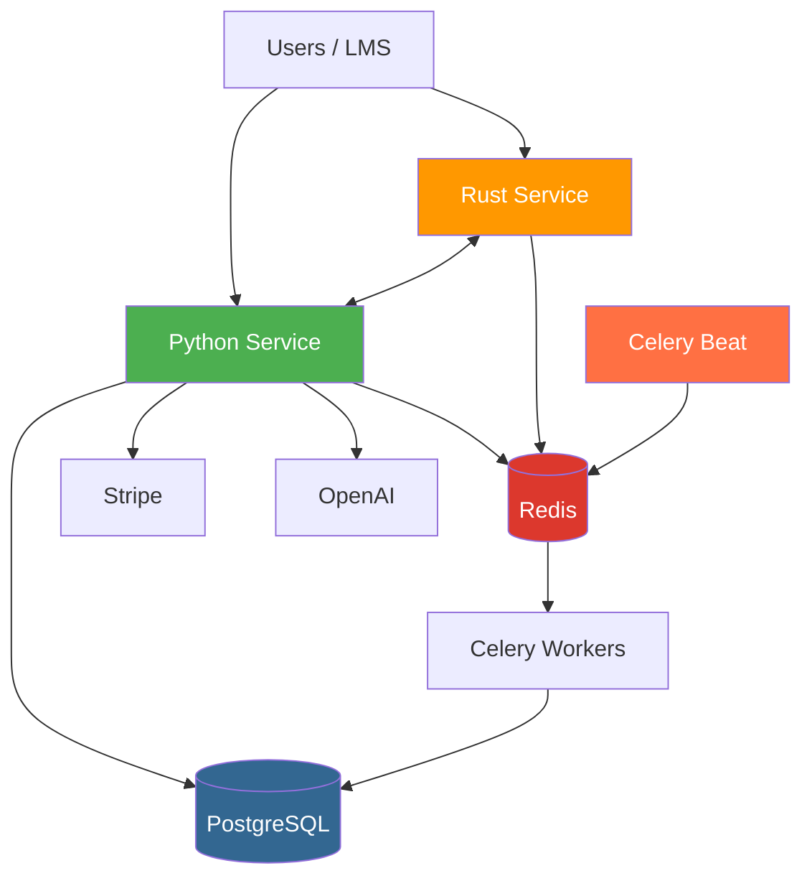

**Live App:** [quizship.craftschoolship.com](https://quizship.craftschoolship.com)  
**API Docs:** [api.quizship.craftschoolship.com/store/docs](https://api.quizship.craftschoolship.com/store/docs)

## Overview

### What it is
A live multiplayer quiz platform. Hosts create quizzes, players join through WebSocket, and the game server handles answers, scores, and session state in real time.

I built the Python service around an existing Rust WebSocket server. Python owns accounts, billing, quotas, the quiz library, AI generation, LTI integration, admin tools, and async jobs. Rust keeps the live game loop.

### Why it exists
The Rust service ran multiplayer sessions, but it had no accounts, plans, payments, LMS launch flow, or admin tooling. Rewriting the game server would have added risk to the working part of the product.

I kept Rust focused on gameplay and added a Flask service beside it for the business and platform layer. The two services share Redis for game state and call each other through narrow API boundaries.

### Outcome

:::tip Key Results
- Python handles product workflows while Rust keeps the real-time game loop
- Stripe subscriptions across three plan tiers, with server-side quota checks
- OpenAI quiz generation from a text prompt
- LTI 1.3 deep linking for LMS course launches
- Admin dashboard for analytics, moderation, impersonation, and gift subscriptions
- Celery handles billing emails, counter resets, analytics snapshots, and cleanup
- 1,200+ registered users
- p95 API latency under 100ms on core endpoints
:::

---

## Architecture

```mermaid
graph TD
    A[Users / LMS] --> C[Python Service]
    A --> D[Rust Service]

    C --> E[(PostgreSQL)]
    C --> R[(Redis)]
    C --> F[Stripe]
    C --> G[OpenAI]

    D --> R
    D <--> C

    CB[Celery Beat] --> R
    R --> CW[Celery Workers]
    CW --> E

    style C fill:#4CAF50,color:#fff
    style D fill:#FF9800,color:#fff
    style R fill:#DC382D,color:#fff
    style E fill:#336791,color:#fff
    style CB fill:#FF7043,color:#fff
```

:::info Architecture Overview
Flask handles auth, subscriptions, quiz content, OpenAI generation, LTI, admin actions, and webhook reconciliation. The Rust service runs WebSocket sessions, stores live state in Redis, and calls Flask for JWT validation and quota checks. Celery workers use Redis as the queue and PostgreSQL as the source of truth for async jobs.
:::

---

## Tech Stack

**Backend:** Python, Flask, Rust, WebSocket  
**Database:** PostgreSQL, Redis  
**Task Queue:** Celery, Celery Beat  
**Integrations:** Stripe, OpenAI, LTI 1.3  
**Infrastructure:** Kubernetes, Helm, ArgoCD  
**Monitoring:** Prometheus, Grafana  
**CI/CD:** Docker, image builds, GitOps deployments

---

## Implementation Setup

### Python Service
- JWT auth with token versioning, so a revocation ends active sessions
- User registration, profiles, account status, plan features, and quota checks
- Stripe subscriptions with webhook reconciliation
- Quiz library CRUD, with quizzes attachable to LTI resource links
- OpenAI quiz generation from prompts into structured questions
- LTI 1.3 provider for LMS deep linking
- Per-endpoint rate limits
- Admin tools for analytics, moderation, support, and subscriptions
- Celery handoff for billing lifecycle emails

### Rust WebSocket Service
I extended the existing game server with narrow calls into Flask:
- Verifies the player's JWT before opening a WebSocket session
- Checks and increments quiz quota before a game starts
- Stores live game state in Redis
- Sends completed session data back to Python for storage

### Stripe Integration
- Three plan tiers with quotas and feature flags tied to the active subscription
- Webhook handlers reconcile local state whenever Stripe sends an event
- Gift subscriptions for free billing periods without invoices
- Server-side quota enforcement, so clients cannot bypass plan limits

### LTI Integration
- LTI 1.3 OIDC launch flow
- Deep linking from LMS course pages into a selected quiz
- Resource links that bind quiz payloads to LMS assignments

### Celery Jobs
- Daily counter reset for subscriptions whose billing period rolled over
- Hourly `analytics_snapshots` upsert for users, quiz launches, AI calls, subscriptions, and LTI activity
- Billing lifecycle emails for trial ending, payment failure, cancellation, and renewal events
- Cleanup for expired sessions and stale records

### Admin Module
- KPI cards for DAU, WAU, MAU, signups, conversion, and plan breakdown
- Redis cache for live aggregate queries
- Time-series endpoints read from `analytics_snapshots`
- User search with status filters and detail pages
- Moderation actions: ban, unban, soft delete, and hard delete
- Short-lived impersonation sessions for support debugging
- Gift subscription assignment by plan and billing period

### Deployment and Monitoring
The platform runs on Kubernetes. Helm packages the services, and ArgoCD syncs deployments from Git. The CI pipeline builds Docker images and updates the manifests used by ArgoCD.

Prometheus collects API and service metrics. Grafana dashboards track latency, throughput, error rate, uptime, worker health, and queue behavior. Alerts cover availability drops, latency spikes, error-rate spikes, and stuck background jobs.

---

## Key Challenges & Solutions

### Challenge 1: Extending a Rust Service I Hadn't Written

**Problem:** The Rust game server served live sessions. I needed accounts, billing, quotas, and persistence without breaking the WebSocket path, and I had not worked in Rust before this project.

**Solution:** I learned the Rust I needed for the integration points: HTTP calls, JSON handling, async errors, and Redis access. I added one call boundary at a time, tested it in staging, then deployed behind the existing game flow. The core game loop stayed intact.

:::success Result
The integration shipped without breaking live sessions. The game loop kept its existing performance profile.
:::

---

### Challenge 2: Quota Overruns Under Concurrent Load

**Problem:** Users have monthly quiz quotas. Two Rust sessions could start at the same time, both pass the quota check, and both increment later. That race allowed over-quota games.

**Solution:** I moved the check and increment into one Flask endpoint that uses a `SELECT ... FOR UPDATE` transaction. PostgreSQL locks the subscription row from check to write. If the session does not confirm, the transaction rolls back the increment.

:::success Result
Concurrent load tests stopped producing over-quota sessions, and production has not shown quota drift from that path.
:::

---

### Challenge 3: Keeping Stripe and Local State in Sync

**Problem:** Stripe webhooks can arrive late, arrive out of order, or fail delivery. A stale subscription row can block a paid user or let an expired plan keep launching quizzes.

**Solution:** Each webhook event triggers a reconciliation pass for the affected customer or subscription. The handler fetches the current Stripe state and writes the local plan, quota, and status from that source instead of trusting only the event payload.

:::success Result
Subscription state now corrects itself on the next Stripe event for that customer. No quota issues have traced back to Stripe sync drift since rollout.
:::

---

### Challenge 4: Admin Analytics Without Full-Table Scans

**Problem:** The admin dashboard needed live KPI cards and historical charts across users, quizzes, subscriptions, AI calls, and LTI launches. Running raw aggregates on every request would have put dashboard traffic on the hottest production tables.

**Solution:** I split live and historical reads. Live KPI cards use single-pass aggregate queries cached in Redis with a short TTL. Historical charts read from `analytics_snapshots`, which Celery upserts every hour with one row per day.

:::success Result
Load tests kept dashboard latency steady as the underlying tables grew.
:::
