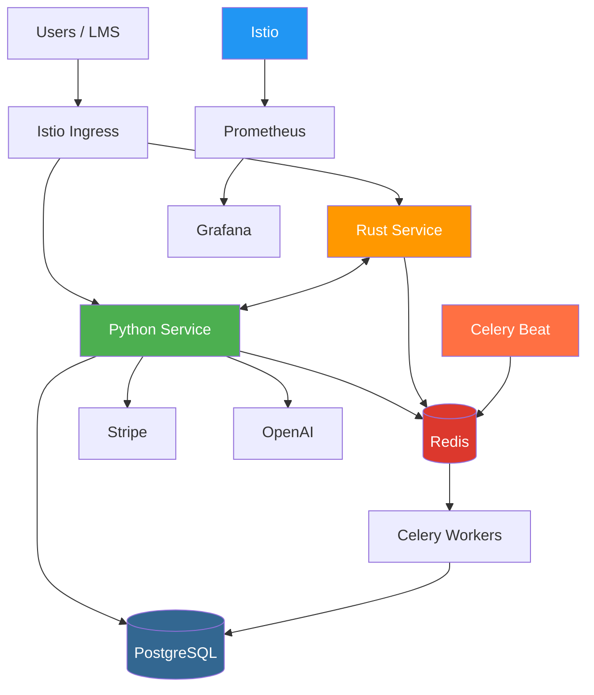

# QuizShip - Live Interactive Quiz Platform

**Live App:** [quizship.craftschoolship.com](https://quizship.craftschoolship.com)  
**API Docs:** [api.quizship.craftschoolship.com/store/docs](https://api.quizship.craftschoolship.com/store/docs)

## Overview

### What it is
Real-time quiz platform with live multiplayer sessions. Players join via WebSocket to compete in quizzes created by hosts. Python service handles business logic, Rust service manages real-time game sessions.

### Why it exists
An existing Rust WebSocket server ran a live multiplayer quiz game with no user management, subscriptions, or monetization. To turn it into a commercial product, a Python microservice was built alongside it to handle user accounts, payments, quiz storage, AI generation, and LMS integration, without touching the performance-critical game server.

### Outcome

:::tip Key Results
- **Hybrid architecture** - Python for business logic, Rust for WebSocket game sessions
- **Stripe subscriptions** - Payment processing with automated quota enforcement across 3 plan tiers
- **AI quiz generation** - OpenAI integration for automated content creation
- **LTI integration** - Deep linking with learning management systems
- **Admin dashboard** - Analytics, user management, and subscription tooling for operators
- **Transactional emails** - Billing lifecycle emails dispatched asynchronously via Celery
- **Production monitoring** - Istio metrics with Grafana dashboards and alerts
- **2,000+ registered users** with peak concurrent sessions handled without latency regression
- **99.9% uptime** sustained in production under normal load
- **sub-100ms p95 API response time** on core endpoints under load
:::

---

## Architecture

```mermaid
graph TD
    A[Users / LMS] --> B[Istio Ingress]

    B --> C[Python Service]
    B --> D[Rust Service]

    C --> E[(PostgreSQL)]
    C --> R[(Redis)]
    C --> F[Stripe]
    C --> G[OpenAI]

    D --> R
    D <--> C

    CB[Celery Beat] --> R
    R --> CW[Celery Workers]
    CW --> E

    IS[Istio] --> P[Prometheus]
    P --> M[Grafana]

    style C fill:#4CAF50,color:#fff
    style D fill:#FF9800,color:#fff
    style R fill:#DC382D,color:#fff
    style E fill:#336791,color:#fff
    style IS fill:#2196F3,color:#fff
    style CB fill:#FF7043,color:#fff
```

:::info Architecture Overview
**Python Service** (Flask) handles auth, subscriptions, quiz library, AI generation, LTI, and admin operations. **Rust Service** manages real-time WebSocket game sessions, using Redis for game state and calling Python for user validation and quota checks. **Redis** is shared between all services and Celery (cache, task queue, and game state). **Celery Workers** access PostgreSQL directly for async tasks. **Celery Beat** schedules recurring tasks. **Stripe** reconciliation happens on webhook events only. **Istio** provides observability through Prometheus and Grafana.
:::

---

## Tech Stack

**Backend:** Python (Flask), Rust (WebSocket)  
**Database:** PostgreSQL, Redis  
**Task Queue:** Celery  
**Integrations:** Stripe, OpenAI, LTI 1.3  
**Infrastructure:** Kubernetes, Helm, ArgoCD, Istio  
**Monitoring:** Prometheus, Grafana  
**CI/CD:** Docker, automated image builds

---

## Implementation Setup

### Python Service (Flask)
- **Authentication:** JWT-based auth with token versioning for instant revocation
- **User management:** Registration, profiles, and account status. Subscription plan determines available features and quotas
- **Subscriptions:** Stripe integration for plan management and webhook-driven reconciliation
- **Quiz library:** CRUD for quiz storage; quizzes can be linked to LTI resources
- **AI quiz generation:** OpenAI integration to generate questions from a text prompt
- **LTI integration:** LTI 1.3 provider for deep linking from LMS platforms
- **Rate limiting:** Per-endpoint throttling
- **Admin module:** Operator API for analytics, user moderation, and subscription management
- **Email:** Billing lifecycle emails offloaded to Celery workers

### Rust WebSocket Service
An existing real-time game server extended to integrate with the Python service:
- **WebSocket connections:** Concurrent quiz sessions with Redis-backed game state
- **User validation:** Calls Python to verify JWTs before allowing session creation
- **Quota checks:** Calls Python to atomically check and increment quota before quiz creation
- **Session reporting:** POSTs completed session data to Python for storage

### Stripe Integration
- **Subscription tiers:** Plan level determines quiz quotas and feature access
- **Webhook handlers:** Every Stripe event triggers immediate local reconciliation with no scheduled sync
- **Gift subscriptions:** Admin can assign free billing periods via Stripe without generating invoices

### LTI Integration
- **Deep linking:** Launch quizzes directly from LMS course pages
- **OIDC flow:** LTI 1.3 authentication and authorization
- **Resource linking:** Associate quiz payloads with LMS assignments

### Celery Tasks
- **Quota resets:** Daily Beat task checks all active subscriptions and resets quiz counters for any whose billing period has rolled over
- **Analytics snapshots:** Hourly Beat task aggregates platform metrics for the current day and upserts a single snapshot row covering users, quiz library, quiz launches, AI generation calls, subscriptions, and LTI activity. Each run overwrites the same row with no duplicates
- **Email delivery:** Ad hoc tasks for billing lifecycle emails triggered by Stripe webhook events
- **Cleanup:** Expired sessions and stale data removal

### Admin Module
- **Analytics:** Live KPI cards (DAU/WAU/MAU, signups, conversion rate, subscription breakdown) from Redis-cached single-pass queries. Time-series from hourly snapshot rows with dedicated endpoints for churn, top users, LTI adoption, and AI usage
- **User management:** Paginated list with search and status filters; per-user detail view with quiz library stats, launch history, and AI generation logs
- **Moderation:** Ban/unban, soft delete, and hard delete with full cascade
- **User impersonation:** Short-lived session scoped to any user for support debugging
- **Gift subscriptions:** Assign any plan for a configurable number of billing periods at no charge

### Deployment and Monitoring

Deployed on Kubernetes via Helm, with ArgoCD handling GitOps sync on repository changes and Docker images built and pushed through an automated CI/CD pipeline. Istio sidecar proxies feed service metrics into Prometheus, surfaced through Grafana dashboards covering API latency, throughput, error rates, and service uptime. Alerts are configured for availability drops, latency spikes, and elevated error rates.

---

## Key Challenges & Solutions

### Challenge 1: Extending an Existing Rust Service

**Problem:** The game server was already in production. Needed to integrate it with the new Python service without breaking live sessions, despite no prior Rust experience.

**Solution:** Learned the subset of Rust needed (HTTP client, JSON serialization, async error handling) and extended the service incrementally, validating each integration point before deploying.

:::success Result
Zero downtime during integration. No performance regression measured after rollout.
:::

---

### Challenge 2: Preventing Quota Overruns Under Concurrent Load

**Problem:** Users have monthly quiz creation limits. With sessions initiated from Rust and quotas stored in Python's database, concurrent requests could push users over their limit before any single check had time to increment the counter.

**Solution:** Quota checks are atomic. Rust calls a single Python endpoint that checks and increments in one locked database transaction. No quota is counted unless the session is confirmed.

:::success Result
No over-quota sessions recorded in production. Quota accuracy held under concurrent load testing.
:::

---

### Challenge 3: Keeping Subscription State in Sync with Stripe

**Problem:** Webhook delivery is not guaranteed. Missed events leave the local database out of sync, causing users to be incorrectly blocked or allowed past their quota.

**Solution:** Every Stripe webhook event triggers immediate reconciliation of the affected subscription, correcting plan and quota state on the spot.

:::success Result
No quota enforcement errors attributable to sync drift since rollout.
:::

---

### Challenge 4: Admin Analytics Without Full-Table Scans

**Problem:** The admin dashboard needed live KPI cards and historical time-series across users, quizzes, subscriptions, and LTI. Aggregating this on every request would be slow at scale.

**Solution:** Two layers: live KPIs run single-pass aggregated queries cached in Redis with a short TTL; time-series reads from a pre-aggregated `analytics_snapshots` table written hourly by Celery, upserted so each day has exactly one row.

:::success Result
Dashboard load time stays flat regardless of data volume. Time-series queries hit indexed snapshot rows instead of full-table scans.
:::