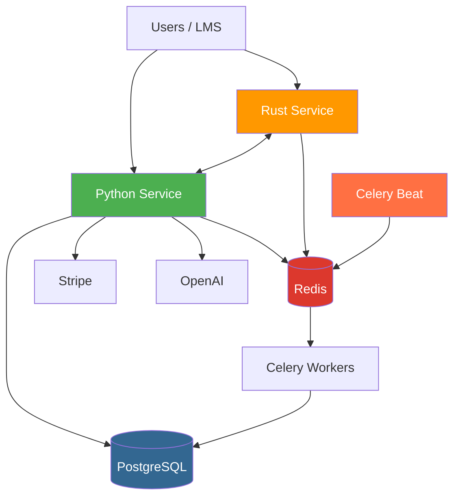

**Live App:** [quizship.craftschoolship.com](https://quizship.craftschoolship.com)  
**API Docs:** [api.quizship.craftschoolship.com/store/docs](https://api.quizship.craftschoolship.com/store/docs)

## Overview

### What it is
A live multiplayer quiz platform. Hosts create quizzes; players join over WebSocket and compete in real time. A Python service holds the business logic (accounts, billing, content), and a Rust service runs the game sessions.

### Why it exists
The Rust WebSocket server already ran a working multiplayer game, but had no notion of user accounts, plans, or payment. Rather than rewrite a working game loop, I built a Python service alongside it to cover the commercial side (auth, Stripe, content storage, AI question generation, LMS integration) and left the game server alone except for a few thin call-outs to the Python API.

### Outcome

:::tip Key Results
- Python and Rust split: Python owns business logic, Rust keeps the realtime game loop
- Stripe subscriptions across three plan tiers, with quotas enforced server-side
- Quiz generation from a text prompt via OpenAI
- LTI 1.3 deep linking so a quiz launches from inside an LMS course page
- Admin dashboard for analytics, moderation, and gift subscriptions
- Billing lifecycle emails dispatched through Celery
- 1,200+ registered users
- p95 API latency under 100ms on core endpoints
:::

---

## Architecture

```mermaid
graph TD
    A[Users / LMS] --> C[Python Service]
    A --> D[Rust Service]

    C --> E[(PostgreSQL)]
    C --> R[(Redis)]
    C --> F[Stripe]
    C --> G[OpenAI]

    D --> R
    D <--> C

    CB[Celery Beat] --> R
    R --> CW[Celery Workers]
    CW --> E

    style C fill:#4CAF50,color:#fff
    style D fill:#FF9800,color:#fff
    style R fill:#DC382D,color:#fff
    style E fill:#336791,color:#fff
    style CB fill:#FF7043,color:#fff
```

:::info Architecture Overview
The Python service (Flask) handles auth, subscriptions, the quiz library, AI generation, LTI, and admin operations. The Rust service runs WebSocket game sessions, keeps live game state in Redis, and calls back to Python for JWT validation and quota checks. Redis is shared as cache, task queue, and game-state store. Celery workers read PostgreSQL for async jobs. Stripe reconciliation happens on webhook events.
:::

---

## Tech Stack

**Backend:** Python (Flask), Rust (WebSocket)  
**Database:** PostgreSQL, Redis  
**Task Queue:** Celery  
**Integrations:** Stripe, OpenAI, LTI 1.3  
**Infrastructure:** Kubernetes, Helm, ArgoCD  
**Monitoring:** Prometheus, Grafana  
**CI/CD:** Docker, automated image builds

---

## Implementation Setup

### Python Service (Flask)
- JWT auth with token versioning, so a revocation cuts every active session
- User management: registration, profiles, account status. The plan on the user's subscription decides which features and quotas they get
- Stripe-driven subscription handling with webhook reconciliation
- Quiz library CRUD; quizzes can attach to LTI resources
- AI quiz generation: text prompt in, structured questions out, via OpenAI
- LTI 1.3 provider for deep linking from LMS platforms
- Per-endpoint rate limiting
- Admin module for operator-side analytics, moderation, and subscription tooling
- Billing lifecycle emails handed off to Celery

### Rust WebSocket Service
The existing realtime game server, extended with hooks back into the Python API:
- WebSocket connections with Redis-backed game state
- Calls Python to verify the player's JWT before opening a session
- Calls Python to check and increment quota atomically before a quiz starts
- POSTs completed session data back to Python for storage

### Stripe Integration
- Three plan tiers, with quotas and features keyed off the active plan
- Webhook handlers reconcile subscription state on every event; no scheduled poller
- Gift subscriptions: an admin can grant free billing periods without generating an invoice

### LTI Integration
- LTI 1.3 OIDC handshake
- Deep linking so a quiz launches from inside the LMS course page
- Resource links bind quiz payloads to LMS assignments

### Celery Tasks
- Daily Beat task resets quiz counters for any subscription whose billing period rolled over
- Hourly Beat task aggregates platform metrics into a single `analytics_snapshots` row per day, covering users, quiz library, quiz launches, AI generation calls, subscriptions, and LTI activity. Each run upserts the same row, so the table never duplicates
- Stripe-webhook-triggered tasks send billing lifecycle emails (trial ending, payment failed, subscription cancelled, etc.)
- Cleanup task removes expired sessions and stale data

### Admin Module
- Live KPI cards (DAU/WAU/MAU, signups, conversion, plan breakdown) from single-pass aggregate queries cached in Redis with a short TTL
- Time-series read from the snapshot table, with endpoints for churn, top users, LTI adoption, and AI usage
- Paginated user list with search and status filters; user-detail view with library stats, launch history, and AI logs
- Moderation: ban/unban, soft delete, hard delete (cascading)
- Short-lived impersonation sessions for support debugging
- Gift-subscription assignment for any plan and any number of billing periods

### Deployment and Monitoring
The platform deploys to Kubernetes via Helm. ArgoCD syncs on repo changes, and a CI pipeline builds and pushes Docker images. Metrics are collected with Prometheus and rendered in Grafana dashboards covering API latency, throughput, error rates, and uptime. Alerts fire on availability drops, latency spikes, and error-rate spikes.

---

## Key Challenges & Solutions

### Challenge 1: Extending a Rust Service I Hadn't Written

**Problem:** The game server was already in production. I needed to wire it into the new Python service without breaking live sessions, and I hadn't written Rust before.

**Solution:** I learned the subset I actually needed (HTTP client, JSON, async error handling) and added the integration points one at a time, validating each in staging before deploying. The existing game-loop code stayed untouched.

:::success Result
No broken sessions during the integration window, and game-loop performance was the same before and after.
:::

---

### Challenge 2: Quota Overruns Under Concurrent Load

**Problem:** Users have monthly quiz quotas. With sessions starting from Rust and quotas stored in Python's database, two concurrent requests could each pass the check before either incremented the counter, letting both through.

**Solution:** I moved the check and the increment into a single Python endpoint backed by a `SELECT ... FOR UPDATE` transaction, so the row is locked from check to write. If the session never confirms, the increment is rolled back.

:::success Result
No over-quota sessions in production. The same logic held under concurrent load tests.
:::

---

### Challenge 3: Keeping Subscription State in Sync with Stripe

**Problem:** Stripe webhook delivery isn't guaranteed. A missed event leaves the local database out of sync, and the user either gets blocked when they shouldn't or sails past their quota.

**Solution:** Every webhook event triggers a reconciliation pass for the affected subscription on the spot, correcting plan and quota state in the database. A missed earlier event gets covered by the next event for that customer.

:::success Result
No quota errors traced back to sync drift since rollout.
:::

---

### Challenge 4: Admin Analytics Without Full-Table Scans

**Problem:** The admin dashboard wanted live KPI cards plus historical time-series across users, quizzes, subscriptions, and LTI. Aggregating that on every request meant a full-table scan per card, which would only get worse as the tables grew.

**Solution:** Two layers. Live KPIs run single-pass aggregate queries and cache the result in Redis with a short TTL, so a refresh hits Redis, not Postgres. Time-series reads from a pre-aggregated `analytics_snapshots` table that Celery upserts hourly, with one row per day. The dashboard reads either Redis or an indexed snapshot row, never the raw event tables.

:::success Result
Dashboard latency held steady through load tests as the underlying data grew.
:::
