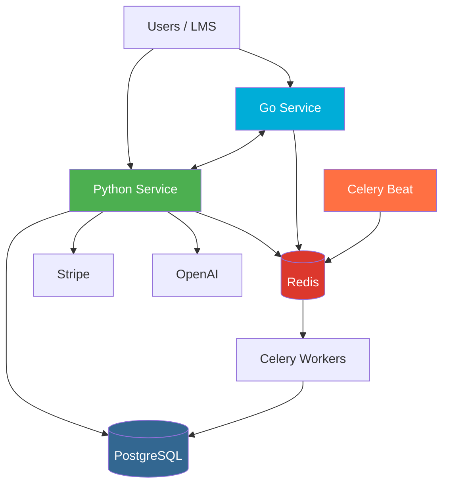

**Live App:** [quizship.craftschoolship.com](https://quizship.craftschoolship.com)  
**API Docs:** [api.quizship.craftschoolship.com/store/docs](https://api.quizship.craftschoolship.com/store/docs)

## Overview

### What it is
A live multiplayer quiz platform. Hosts create quizzes, players join through WebSocket, and the game server handles answers, scores, and session state in real time.

I built both services. Go runs the live game loop. Python owns accounts, billing, quotas, the quiz library, AI generation, LTI integration, admin tools, and async jobs.

### Why it exists
A single language for the whole platform would have forced a tradeoff. Python's ecosystem made the product side fast to build, but its WebSocket and concurrency story is weaker. Go's goroutines fit live sessions, but rebuilding Flask, SQLAlchemy, and the Stripe SDK ergonomics in Go would have cost months for no end-user gain.

I split the platform along that grain. Go owns WebSocket sessions and live game state. Python owns the product surface. The two services share a JWT secret for local token validation and Redis for live state.

### Outcome

:::tip Key Results
- Two-language platform: Go for live gameplay, Python for the product surface
- Plugin architecture for game types — adding a new game is a single drop-in
- Stripe subscriptions across three plan tiers with server-side quota and concurrency safeguards
- OpenAI quiz generation from text prompts
- LTI 1.3 deep linking for LMS course launches
- Admin dashboard with live KPIs and historical snapshots
- Sticky WebSocket routing that scales horizontally without breaking in-flight games
- 1,200+ registered users
- p95 API latency under 100ms on core endpoints
:::

---

## Architecture

```mermaid
graph TD
    A[Users / LMS] --> C[Python Service]
    A --> D[Go Service]

    C --> E[(PostgreSQL)]
    C --> R[(Redis)]
    C --> F[Stripe]
    C --> G[OpenAI]

    D --> R
    D <--> C

    CB[Celery Beat] --> R
    R --> CW[Celery Workers]
    CW --> E

    style C fill:#4CAF50,color:#fff
    style D fill:#00ADD8,color:#fff
    style R fill:#DC382D,color:#fff
    style E fill:#336791,color:#fff
    style CB fill:#FF7043,color:#fff
```

:::info Architecture Overview
Flask handles auth, subscriptions, quiz content, OpenAI generation, LTI, admin, and webhooks. Go runs WebSocket sessions, validates JWTs locally with the shared secret, stores live state in Redis, and calls Flask only when it needs the source of truth (quota check, session result write-back). Celery workers use Redis as the queue and PostgreSQL as the source of truth for async jobs.
:::

---

## Tech Stack

**Backend:** Python, Flask, Go, WebSocket  
**Database:** PostgreSQL, Redis  
**Task Queue:** Celery, Celery Beat  
**Integrations:** Stripe, OpenAI, LTI 1.3  
**Infrastructure:** Kubernetes, Helm, ArgoCD  
**Monitoring:** Prometheus, Grafana  
**CI/CD:** Docker, image builds, GitOps deployments

---

## Implementation Setup

### Python Service
- JWT auth with token versioning, so a revocation ends active sessions on the next request
- Stripe subscriptions with webhook reconciliation as the source of truth
- Quiz library CRUD with a `kind` discriminator so each game type mounts its own editor and host view
- OpenAI quiz generation from prompts into structured questions
- LTI 1.3 provider with deep linking and `kind` threaded into the launch redirect
- Per-endpoint and per-user rate limits on sensitive routes
- Admin tools for analytics, moderation, impersonation, and gift subscriptions
- Celery handoff for billing emails, counter resets, snapshots, and cleanup

### Go WebSocket Service
- Validates the player's JWT locally with the shared secret before opening the socket
- Calls Flask to check and increment quota inside one locked transaction before a game starts
- Holds the live game state machine in memory and snapshots it to Redis, so a pod restart can rehydrate
- Posts the final session record back to Flask when the game ends

### Stripe Integration
- Three plan tiers with quotas and feature flags tied to the active subscription
- Webhook reconciliation against live Stripe state, not the event payload
- Per-user mutex on update, cancel, and reactivate to prevent double-charge races
- Webhook event-id deduplication so retried deliveries do not re-run side effects
- `SubscriptionSchedule` release before any cancellation toggle, so reactivate works after a queued downgrade
- Token version bump on every entitlement change so stale JWTs stop validating immediately
- Gift subscriptions for free billing periods without invoices

### LTI Integration
- LTI 1.3 OIDC launch flow
- Deep linking from LMS course pages into a selected quiz
- Resource links that bind quiz payloads to LMS assignments

### Celery Jobs
- Daily counter reset for free-plan and yearly subscriptions
- Hourly `analytics_snapshots` upsert powering historical charts
- Billing lifecycle emails for activation, renewal, payment failure, and cancellation
- Cleanup for expired sessions and stale records

### Admin Module
- Live KPI cards (DAU/WAU/MAU, signups, conversion, plan breakdown) cached in Redis
- Historical charts read from `analytics_snapshots`
- User search, status filters, detail pages, and moderation actions
- Short-lived impersonation sessions for support
- Gift subscription assignment by plan and billing period

### Deployment and Monitoring
Kubernetes runs the platform. Helm packages the services and ArgoCD syncs them from Git. CI builds Docker images and updates the manifests ArgoCD watches.

The Go deployment scales horizontally with sticky routing — every request for the same game lands on the same pod, while paths without a game id fall back to round-robin. Redis snapshots cover pod restarts.

Prometheus collects metrics. Grafana dashboards track latency, throughput, error rate, uptime, and queue health. Alerts cover availability drops, latency spikes, and stuck background jobs.

---

## Key Challenges & Solutions

### Challenge 1: Adding New Game Types Without Rewriting Every Page

**Problem:** The first version assumed one game type. Adding a second would have meant if/else branches across the authoring page, the host watcher, the player view, the LTI flow, and the dashboard. Every new game would have multiplied that branching.

**Solution:** I lifted every per-game concern behind a contract interface and a registry keyed by `kind`. Authoring, hosting, and playing each have their own sub-contract. The pages read from the registry instead of switching on string literals. For LMS launches that arrive without an explicit `kind`, the frontend infers it by asking each registered contract whether it recognizes the payload shape.

:::success Result
Adding a new game is a single drop-in: one directory, one contract export, one registration. Crossword shipped as the second type without touching the host, play, or dashboard pages.
:::

---

### Challenge 2: Scaling a Stateful WebSocket Server Behind a Stateless Ingress

**Problem:** Each live game's state machine lives in memory on a single Go pod. HTTP and WebSocket traffic for that game must land on the same pod, or it hits a cold pod with no record of the session. Round-robin balancing would break in-flight games as soon as the deployment scaled past one replica.

**Solution:** I configured the nginx ingress to hash by a regex on the request URI that captures `game_id` from the path. Same game, same pod. Paths without a game id fall back to round-robin. The Go service rehydrates from a Redis snapshot when it gets a request for a game it does not yet hold in memory, so a pod restart loses no session state.

:::success Result
The game deployment scales horizontally without breaking active sessions. Rolling deploys do not drop live games.
:::

---

### Challenge 3: Quota Overruns Under Concurrent Load

**Problem:** Users have monthly quiz quotas. Two game starts could pass the quota check at the same time and both increment later, leaving the user over quota.

**Solution:** I moved the check and increment into one Flask endpoint that runs `SELECT ... FOR UPDATE` on the subscription row inside a single transaction. PostgreSQL holds the row lock from check to write, so the second concurrent caller waits or fails fast. If the session never confirms, the transaction rolls back the increment.

:::success Result
Concurrent load tests stopped producing over-quota sessions. Production has not shown quota drift from that path.
:::

---

### Challenge 4: Keeping Stripe and Local State in Sync Under Real Traffic

**Problem:** Stripe webhooks arrive late, arrive out of order, and redeliver after transient failures. Concurrent user actions (a double-click on upgrade, a reactivate while a downgrade is queued) can race into Stripe and produce divergent state. The first version trusted webhook payloads and ran subscription updates without serialization; both assumptions broke under live traffic.

**Solution:** I rebuilt the flow around three rules.
- Reconciliation reads from Stripe, not the event. Every webhook handler refetches the subscription with expanded product data and writes local state from that response.
- A per-user Redis mutex serializes update, cancel, and reactivate, so a double-click cannot race two Stripe modify calls.
- Webhook event-id deduplication, idempotency keys on checkout creation, and a defensive schedule release before any cancellation toggle cover the rest of the edge cases.

:::success Result
Subscription state corrects itself on the next Stripe event for the affected customer. None of the original race conditions has recurred in production since rollout.
:::

