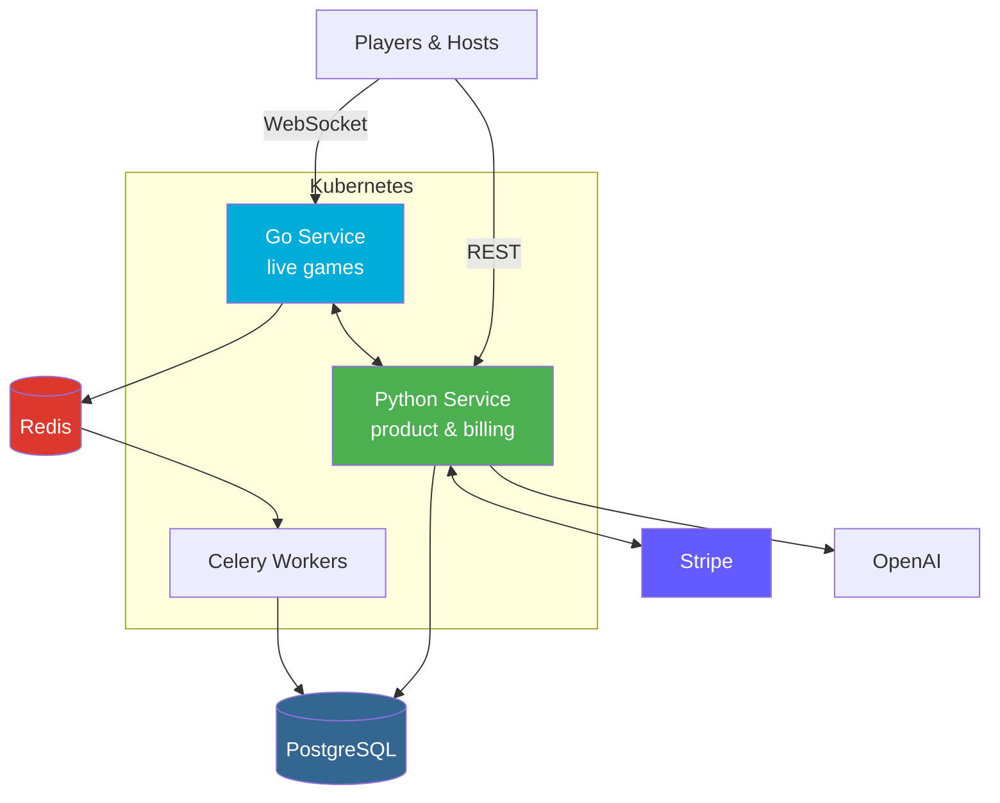

**Live App:** [quizship.craftschoolship.com](https://quizship.craftschoolship.com)  
**API Docs:** [api.quizship.craftschoolship.com/store/docs](https://api.quizship.craftschoolship.com/store/docs)

## Overview

### What it is
A live multiplayer quiz platform. Hosts create quizzes, players join through WebSocket, and the game server handles answers, scores, and session state in real time.

I built both services. Go runs the live game loop. Python owns accounts, billing, quotas, the quiz library, AI generation, LTI integration, admin tools, and async jobs.

### Why it exists
A single language for the whole platform would have forced a tradeoff. Python's ecosystem made the product side fast to build, but its WebSocket and concurrency story is weaker. Go's goroutines fit live sessions, but rebuilding Flask, SQLAlchemy, and the Stripe SDK ergonomics in Go would have cost months for no end-user gain.

I split the platform along that grain. Go owns WebSocket sessions and live game state. Python owns the product surface. The two services share a JWT secret for local token validation and Redis for live state.

### Outcome

:::tip Key Results
- Two services in production: Go runs the live game loop, Python owns accounts, billing, content, and admin
- Stripe subscriptions across three plan tiers, hardened against webhook races and concurrent updates
- Sticky WebSocket routing scales the game tier horizontally without dropping in-flight games
- New game types are one drop-in module; the second type shipped without touching the host, play, or dashboard pages
- OpenAI quiz generation and LTI 1.3 launches from LMS courses
:::

---

## Architecture

```mermaid
graph TD
    U["Players & Hosts"] -->|REST| PY
    U -->|WebSocket| GO

    subgraph K8S ["Kubernetes"]
        GO[Go Service<br/>live games] <--> PY[Python Service<br/>product & billing]
        CW[Celery Workers]
    end

    GO --> RD[(Redis)]
    RD --> CW
    PY --> PG[(PostgreSQL)]
    CW --> PG

    PY <--> ST[Stripe]
    PY --> OAI[OpenAI]

    style PY fill:#4CAF50,color:#fff
    style GO fill:#00ADD8,color:#fff
    style RD fill:#DC382D,color:#fff
    style PG fill:#336791,color:#fff
    style ST fill:#635BFF,color:#fff
```

:::info Architecture Overview
Flask handles auth, subscriptions, quiz content, OpenAI generation, LTI, admin, and webhooks. Go runs WebSocket sessions, validates JWTs locally with the shared secret, stores live state in Redis, and calls Flask only when it needs the source of truth (quota check, session result write-back). Celery workers use Redis as the queue and PostgreSQL as the source of truth for async jobs.
:::

---

## Implementation Highlights

- The Python service owns the product surface: JWT auth with token versioning so a revocation ends active sessions on the next request, per-user rate limits on sensitive routes, OpenAI quiz generation, and admin tools with short-lived impersonation and gift subscriptions.
- The Go service validates JWTs locally with the shared secret, holds each live game's state machine in memory, snapshots it to Redis so a pod restart can rehydrate, and posts the final session record back to Flask.
- LTI 1.3 deep linking lets a teacher bind a quiz to an LMS assignment and launch it from the course page.
- Celery workers handle billing emails, daily quota resets, hourly analytics snapshots, and cleanup, with Redis as the queue and PostgreSQL as the source of truth.
- Helm packages both services and ArgoCD syncs them from Git. Prometheus and Grafana alert on latency, error rate, uptime, and stuck background jobs.

---

## Key Challenges & Solutions

### Challenge 1: Adding New Game Types Without Rewriting Every Page

**Problem:** The first version assumed one game type. Adding a second would have meant if/else branches across the authoring page, the host watcher, the player view, the LTI flow, and the dashboard. Every new game would have multiplied that branching.

**Solution:** I lifted every per-game concern behind a contract interface and a registry keyed by `kind`. Authoring, hosting, and playing each have their own sub-contract. The pages read from the registry instead of switching on string literals. For LMS launches that arrive without an explicit `kind`, the frontend infers it by asking each registered contract whether it recognizes the payload shape.

:::success Result
Adding a new game is a single drop-in: one directory, one contract export, one registration. Crossword shipped as the second type without touching the host, play, or dashboard pages.
:::

---

### Challenge 2: Scaling a Stateful WebSocket Server Behind a Stateless Ingress

**Problem:** Each live game's state machine lives in memory on a single Go pod. HTTP and WebSocket traffic for that game must land on the same pod, or it hits a cold pod with no record of the session. Round-robin balancing would break in-flight games as soon as the deployment scaled past one replica.

**Solution:** I configured the nginx ingress to hash by a regex on the request URI that captures `game_id` from the path. Same game, same pod. Paths without a game id fall back to round-robin. The Go service rehydrates from a Redis snapshot when it gets a request for a game it does not yet hold in memory, so a pod restart loses no session state.

:::success Result
The game deployment scales horizontally without breaking active sessions. Rolling deploys do not drop live games.
:::

---

### Challenge 3: Keeping Stripe and Local State in Sync Under Real Traffic

**Problem:** Stripe webhooks arrive late, arrive out of order, and redeliver after transient failures. Concurrent user actions (a double-click on upgrade, a reactivate while a downgrade is queued) can race into Stripe and produce divergent state. The first version trusted webhook payloads and ran subscription updates without serialization; both assumptions broke under live traffic.

**Solution:** I rebuilt the flow around three rules.
- Reconciliation reads from Stripe, not the event. Every webhook handler refetches the subscription with expanded product data and writes local state from that response.
- A per-user Redis mutex serializes update, cancel, and reactivate, so a double-click cannot race two Stripe modify calls.
- Webhook event-id deduplication, idempotency keys on checkout creation, and a defensive schedule release before any cancellation toggle cover the rest of the edge cases.

:::success Result
Subscription state corrects itself on the next Stripe event for the affected customer. None of the original race conditions has recurred in production since rollout.
:::

