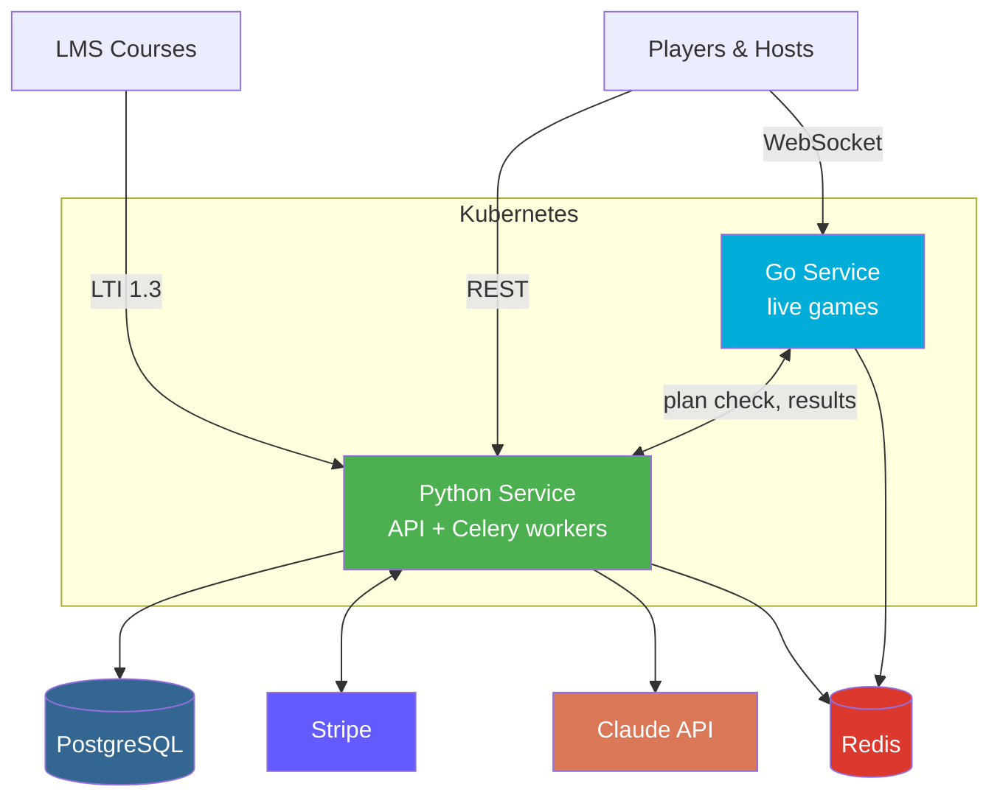

**Live App:** [quizship.com](https://quizship.com)  
**API Docs:** [api.quizship.com/store/docs](https://api.quizship.com/store/docs)

## Overview

### What it is
A live multiplayer quiz platform. Hosts build a quiz in one of several game formats or generate one with Claude, players join through WebSocket, and the game server handles answers, scores, and session state in real time.

I built both services. Go runs the live game loop. Python owns accounts, billing, quotas, the quiz library, AI generation, LTI integration, admin tools, analytics, and async jobs.

### Why it exists
A single language would have forced a tradeoff. Python's ecosystem made the product side fast to build, but its WebSocket and concurrency story is weaker. Go's goroutines fit live sessions, but rebuilding Flask, SQLAlchemy, and the Stripe SDK ergonomics in Go would have cost months for no end-user gain.

So I split the platform along that grain: Go for live sessions, Python for the product. The services share a JWT secret, so Go validates tokens without a network call, and Go calls Flask only where Flask holds the truth: the plan check when a game starts and the result when it ends.

### Outcome

:::tip Key Results
- Tiered Stripe subscriptions with a metered AI quota, hardened against webhook races, concurrent updates, refunds, and disputes
- Sticky WebSocket routing scales the game tier horizontally without dropping in-flight games
- New game formats ship as drop-in modules on the Go server and the frontend
- Claude quiz generation from a prompt or a PDF, and LTI 1.3 launches from LMS courses
- About 1,750 store tests and a race-checked Go suite gate every image build
:::

---

## Architecture

```mermaid
flowchart TB
    LMS["LMS Courses"]
    U["Players & Hosts"]

    subgraph K8S ["Kubernetes"]
        PY["Python Service<br/>API + Celery workers"]
        GO["Go Service<br/>live games"]
    end

    LMS --->|LTI 1.3| PY
    U -->|REST| PY
    U -->|WebSocket| GO
    GO <-->|plan check, results| PY

    PY --> PG[(PostgreSQL)]
    PY <--> ST[Stripe]
    PY --> CL[Claude API]
    PY --> RD[(Redis)]
    GO ---> RD

    style PY fill:#4CAF50,color:#fff
    style GO fill:#00ADD8,color:#fff
    style RD fill:#DC382D,color:#fff
    style PG fill:#336791,color:#fff
    style ST fill:#635BFF,color:#fff
    style CL fill:#D97757,color:#fff
```

:::info Architecture Overview
Flask handles auth, billing, content, AI generation, LTI, admin, and webhooks, with Redis for caching, rate limits, and locks. Go runs the live games, keeps their state in Redis, and calls Flask for the plan check at creation and the result at the end. Celery workers take jobs from Redis and write to PostgreSQL.
:::

---

## Implementation Highlights

- Each live game is an actor: one goroutine owns its state and drains a mailbox of player events, so game code needs no locks. A panic rolls that game back to its last Redis snapshot instead of crashing the pod, and WebSocket heartbeats every 10 seconds drop dead connections so abandoned games get cleaned up.
- Finished games reach the Python service through a Redis outbox with exponential backoff, leased claims so two pods never post the same result, and a dead-letter set for entries that run out of retries. A store outage delays results instead of losing them. Plans stay cached with a 7-day stale fallback, so a Stripe outage doesn't block feature checks either.
- Every payment, refund, and dispute lands in a ledger that feeds MRR, ARPU, the paid churn rate, and MRR movements split into new, expansion, contraction, and churn. Each AI generation records its tokens and cost, and the admin view puts AI spend per account next to the plan's price, which shows each tier's margin.
- LTI 1.3 launches verify the LMS's signed ID token against its JWKS, fetched only from public HTTPS hosts to block SSRF, and the editor token travels in the URL fragment so it never reaches server logs. Sessions are revocable on the next request, and auth, billing, and AI routes are rate limited.
- Helm packages both services and the Celery workers, and ArgoCD syncs them from Git. CI gates each image on its test suite, the Go one under the race detector. Prometheus and Grafana alert on latency, error rate, uptime, and stuck background jobs.

---

## Key Challenges & Solutions

### Challenge 1: Adding New Game Types Without Rewriting Every Page

**Problem:** The first version assumed one game type. A second would have meant if/else branches across the authoring page, the host watcher, the player view, the LTI flow, and the dashboard, multiplied by every game after it.

**Solution:** I moved every per-game concern behind a contract interface and a registry keyed by `kind`, with sub-contracts for authoring, hosting, and playing. Pages read from the registry instead of switching on string literals. For LMS launches without an explicit `kind`, the frontend asks each registered contract whether it recognizes the payload. The Go server does the same with a `game.Type` interface, so room, snapshot, and result code never branch on `kind`.

:::success Result
A new game is one directory, one contract, and one registration on each side. The second format shipped without touching the host, play, or dashboard pages, and later formats followed the same path.
:::

---

### Challenge 2: Scaling a Stateful WebSocket Server Behind a Stateless Ingress

**Problem:** Each live game's state lives in memory on one Go pod, so all of its HTTP and WebSocket traffic must reach that pod. Round-robin balancing would break in-flight games as soon as the deployment scaled past one replica.

**Solution:** The nginx ingress hashes on the `game_id` a regex captures from the request path, so the same game always reaches the same pod. Other paths fall back to round-robin. A pod that gets a game it doesn't hold rehydrates it from the Redis snapshot. On shutdown, a pod closes its sockets with code 1001; clients reconnect, and the new owner restores the snapshot and reschedules running timers.

:::success Result
The game deployment scales horizontally without breaking active sessions. Rolling deploys do not drop live games.
:::

---

### Challenge 3: Keeping Stripe and Local State in Sync Under Real Traffic

**Problem:** Stripe webhooks arrive late, out of order, and again after transient failures. Concurrent user actions (a double-click on upgrade, a reactivate while a downgrade is queued) can race into Stripe. The first version trusted webhook payloads and didn't serialize updates, and both assumptions broke under live traffic. Mid-period plan changes caused more bugs: a last-day upgrade handed out a full month of AI quota, and a refund left the paid plan running.

**Solution:** I rebuilt the flow around four rules.
- Handlers refetch the subscription from Stripe and write local state from that response, not from the event. A failing handler answers 500 so Stripe retries, and an event-id marker stops a retry from applying twice.
- A per-user Redis mutex and a Postgres row lock serialize update, cancel, and reactivate.
- Each customer holds one live subscription: the store refuses a second checkout, expires stale sessions, and cancels duplicates.
- Upgrades invoice the prorated difference at once and grant only the remaining share of the new AI quota. Downgrades wait for period end on a subscription schedule. A dispute or a full refund of the current period ends the paid plan.

:::success Result
Subscription state corrects itself on the next Stripe event for that customer. I verified each billing path end to end with Stripe test clocks, and none of the original races has recurred in production.
:::

---

### Challenge 4: Getting Playable Quizzes Out of a Language Model

**Problem:** Each format has its own JSON shape and rules: answer counts, fields that must agree, and values that must stay hidden from players. A reply can pass a JSON schema and still be unplayable, or padded with placeholder text.

**Solution:** Generation runs on Claude with structured output bound to each format's schema, so every reply parses. A per-format validator checks the rules a schema can't express and catches placeholder text. On a failure, the service sends Claude the exact problems for one repair round if the time budget allows. Input is a prompt or a PDF, and the shared system prompt is cached.

:::success Result
A draft that fails the repair round returns an error and costs the host no quota, while its token cost still counts toward the plan's margin.
:::
