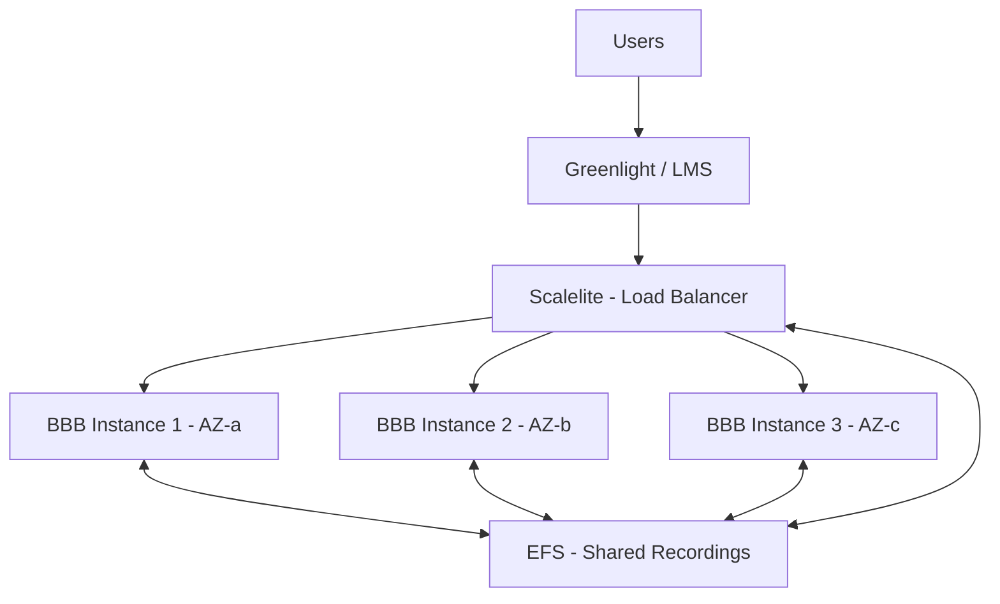

## Overview

### What it is
Scalable, multi-AZ deployment of BigBlueButton (open-source video conferencing platform) on AWS with automated infrastructure management and comprehensive observability.

### Why it exists
BigBlueButton servers are stateful - meetings run on single instances and recordings are stored locally. This creates scaling challenges and single points of failure. Scalelite acts as a load balancer and BBB API proxy that distributes meetings across multiple servers while presenting a single endpoint for users to access all recordings.

### Outcome

:::tip Key Results
- **73% faster instance launches** (11min → 3min) via custom AMI and optimized bootstrap scripts
- **Zero meeting disruptions** during auto-scaling events
- **Centralized recording management** accessible from any server via shared storage
- **Full observability** with Prometheus, Grafana, and centralized logging
:::

---

## Architecture

### High-level Flow

:::info Key Components
**Greenlight/LMS**  → **Scalelite** (load balancer + BBB API proxy, mounted to EFS) → **BBB instances** (EC2 Auto Scaling Group, mounted to EFS) → **EFS** (shared recordings accessible by Scalelite and all BBB instances)
:::

---

## Tech Stack

**Cloud & Infrastructure:** AWS (EC2, Auto Scaling Groups, EKS, EFS, Route53, CloudWatch)  
**IaC:** CloudFormation 
**Automation:** Bash scripting, Systemd services  
**Containers & Orchestration:** Kubernetes (EKS), Helm, Docker  
**Monitoring & Logging:** Prometheus (EC2 service discovery), Grafana, Loki, Promtail  

---

## Implementation Setup

### Infrastructure Provisioning
- **Multi-AZ VPC** with public subnets across multiple availability zones
- **Auto Scaling Group** with CloudFormation-managed capacity configuration
- **EFS file system** with automated backups for shared recordings
- **Route53 hosted zone** for DNS management

### Custom AMI Development
Built custom Ubuntu 22.04 AMI with BigBlueButton v3 pre-installed, including all dependencies and default configurations. This reduced instance bootstrap from full installation to configuration-only.

### Automation Scripts
Built custom bash scripts integrated with systemd services to handle:
- **Route53 management:** Automatic A record creation on instance launch, deletion on termination
- **BBB configuration:** Instance-specific setup for BigBlueButton, FreeSWITCH, and TURN server
- **Scalelite integration:** Automatic server registration/de-registration via API
- **Storage mounting:** EFS volume attachment and configuration
- **Observability agents:** Installation of Promtail and metrics exporters (bbb-exporter, node-exporter)

### Helm Charts
Developed Helm charts for Kubernetes deployments:
- **Scalelite chart:** Load balancer deployment with database configuration and EFS integration
- **Greenlight chart:** User-facing web interface with authentication support

### Management Tooling
Built custom CLI tool for complete stack lifecycle management (create, update, delete) with CloudFormation template validation, deployment automation, and automated S3 bucket management for template and script distribution.

### Deployment Strategy

**Auto Scaling Configuration:**
- **Scale-out trigger:** Lowest CPU utilization across fleet exceeds 80%
- **Scale-in trigger:** Lowest CPU utilization across fleet falls below 6%
- **Instance protection:** Active meetings prevent scale-in termination
- **CloudWatch Alarms:** Real-time metrics trigger scaling policies

:::note Zero-Downtime Updates
CloudFormation rolling updates launch new instances with updated configurations. Old instances remain active until new ones pass health checks.
:::

### Monitoring & Logging Setup

**Metrics Collection:**
- Configured Prometheus with EC2 service discovery for automatic instance detection
- **BBB-specific metrics:** Custom exporter tracking meetings, participants, recordings
- **System metrics:** Node exporter monitoring CPU, memory, disk, network

**Log Aggregation:**
- Deployed Loki via internal load balancer (accessible to EC2, not internet)
- Configured Promtail agents on each instance forwarding logs to Loki
- Enabled centralized log search and correlation

**Visualization:**
- Built custom Grafana dashboard combining metrics and logs
- Real-time monitoring of fleet health and meeting capacity

---

## Key Challenges & Solutions

### Challenge 1: Slow Instance Launch Times

**Problem:** Initial deployments required 11 minutes per instance due to installing BigBlueButton, dependencies, SSL certificates, and configurations from scratch during bootstrap.

**Solution:** Created custom AMI with BigBlueButton pre-installed and default configurations. Developed optimized bootstrap scripts that only handle instance-specific configurations (hostname, DNS, Scalelite registration).

:::success Result
**73% improvement** - Launch time reduced from 11 minutes to 3 minutes, enabling faster response to scaling events
:::

---

### Challenge 2: Meeting Disruptions During Scale-In

**Problem:** CloudWatch-triggered scale-in events could terminate EC2 instances actively hosting meetings, resulting in abrupt disconnections for users.

**Solution:** Implemented scale-in protection mechanism in bootstrap scripts that queries BBB API for active meetings. Instances with ongoing meetings are protected from termination. CloudWatch alarm threshold set at 6% CPU to ensure only truly idle instances are removed.

:::success Result
**Zero meeting interruptions** during auto-scaling operations while maintaining cost efficiency
:::

---

### Challenge 3: Centralized Recording Access

**Problem:** BigBlueButton stores recordings locally on each server. Scalelite acts as a single BBB instance endpoint, so it needed access to recordings from all backend servers to serve them to users from one unified location.

**Solution:** Deployed EFS as shared storage layer, mounted on both EC2 instances and Scalelite pods in EKS. All BBB servers write recordings to EFS, allowing Scalelite to access and serve recordings from any backend server. Enabled automated EFS backups for data protection. Ensured Scalelite runs in the same VPC for network access to EFS.

:::success Result
**Seamless recording access** - Scalelite serves all recordings from a single endpoint, regardless of which backend server originally hosted the meeting
:::

---

### Challenge 4: Dynamic DNS and Server Registration

**Problem:** Auto-scaled instances needed unique DNS records for SSL certificate generation and automatic registration with Scalelite to receive meeting assignments. Manual management was impossible in a dynamic environment.

**Solution:** Built systemd services and bash scripts that:
- Create Route53 A records on instance launch using AWS CLI
- Delete records on instance termination
- Register server with Scalelite API using shared secret
- Deregister gracefully during shutdown
- Integrated with Let's Encrypt for automated SSL certificates

:::success Result
**Fully automated infrastructure** - New instances automatically receive DNS records, SSL certificates, and join the load-balanced pool without manual intervention
:::