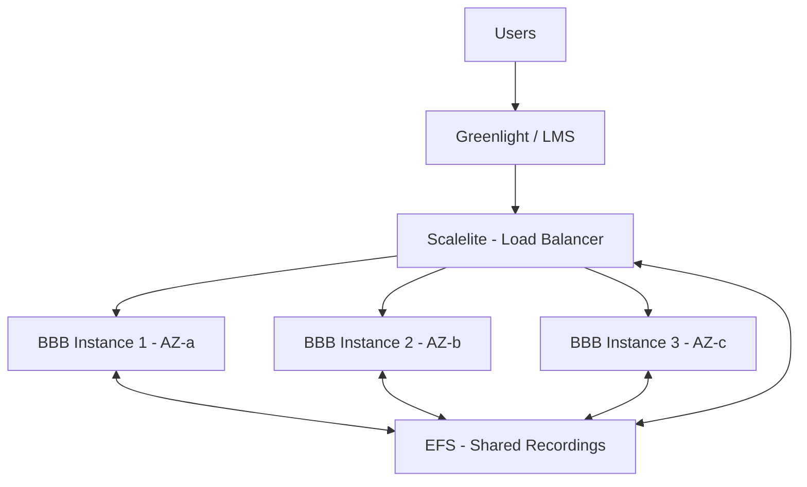

## Overview

### What it is
A multi-AZ BigBlueButton deployment on AWS. EC2 instances run BBB itself; Scalelite sits in front as a load balancer and API proxy; EFS holds recordings so any backend can write them and any client can fetch them through Scalelite.

### Why it exists
BBB is stateful: a meeting lives on a single instance, and recordings get written to that instance's local disk. A single-server setup caps capacity, and if the box dies the recordings go with it. Scalelite plus shared storage lets the fleet grow and shrink without users seeing which backend they landed on.

### Outcome

:::tip Key Results
- Instance launch time down from 11 minutes to 3 via a custom AMI and a stripped bootstrap
- No meeting disruptions during auto-scaling: instances with active meetings stay protected from termination
- Recordings centralised on EFS, served through Scalelite from a single endpoint
- Prometheus, Grafana, and Loki covering metrics and logs across the fleet
:::

---

## Architecture

### High-level Flow

```mermaid
graph TD
    A[Users] --> B[Greenlight / LMS]
    B --> C[Scalelite - Load Balancer]
    C --> D[BBB Instance 1 - AZ-a]
    C --> E[BBB Instance 2 - AZ-b]
    C --> F[BBB Instance 3 - AZ-c]
    D <--> G[EFS - Shared Recordings]
    E <--> G
    F <--> G
    C <--> G
```

:::info Key Components
Greenlight or an LMS forwards into Scalelite, which proxies each meeting to one BBB instance in the Auto Scaling Group. Every BBB instance and Scalelite itself mount the same EFS volume, so a recording written by one backend is visible to all of them.
:::

---

## Tech Stack

**Cloud & Infrastructure:** AWS (EC2, Auto Scaling Groups, EKS, EFS, Route53, CloudWatch)  
**IaC:** CloudFormation  
**Automation:** Bash scripts, systemd services  
**Containers & Orchestration:** Kubernetes (EKS), Helm, Docker  
**Monitoring & Logging:** Prometheus (EC2 service discovery), Grafana, Loki, Promtail

---

## Implementation Setup

### Infrastructure Provisioning
- Multi-AZ VPC with public subnets across availability zones
- Auto Scaling Group with capacity managed in CloudFormation
- EFS file system with backups for shared recordings
- Route53 hosted zone for DNS

### Custom AMI
I built a custom Ubuntu 22.04 AMI with BigBlueButton v3 and its dependencies pre-installed. Bootstrap drops from a full install to instance-specific configuration only.

### Automation Scripts
Bash scripts wired up as systemd services run on instance launch and shutdown:
- Route53 A records created on launch, deleted on shutdown
- Per-instance config for BigBlueButton, FreeSWITCH, and the TURN server
- Scalelite registration and de-registration via the Scalelite API
- EFS mount and configuration
- Promtail and metric exporters (bbb-exporter, node-exporter) installed at boot

### Helm Charts
- Scalelite chart: deployment with database config and EFS mount
- Greenlight chart: user-facing UI with auth wired in

### Management Tooling
I built a small CLI for the full stack lifecycle (create, update, delete). It validates the CloudFormation templates, runs the deployments, and keeps the S3 bucket that holds templates and bootstrap scripts in sync.

### Deployment Strategy

**Auto Scaling Configuration:**
- Scale-out: lowest CPU across the fleet crosses 80%
- Scale-in: lowest CPU across the fleet falls below 6%
- Instance protection: a box with an active meeting can't be terminated
- CloudWatch alarms drive the threshold-based policies above
- Scheduled scaling actions add capacity ahead of pre-planned events (large webinars, exam slots) so the fleet is warm before traffic arrives

:::note Zero-Downtime Updates
CloudFormation rolling updates bring up new instances with the new config. Old instances stay in service until the new ones pass health checks.
:::

### Monitoring & Logging Setup

**Metrics:**
- Prometheus with EC2 service discovery, so new instances appear without config changes
- bbb-exporter for BBB-specific signals (meetings, participants, recordings)
- node-exporter for CPU, memory, disk, and network

**Logs:**
- Loki sits behind an internal load balancer, reachable from EC2 but not from the internet
- Promtail on every instance ships logs to Loki
- Logs are searchable across the fleet from one place

**Visualisation:**
- A Grafana dashboard combines metrics and logs for fleet health and live meeting capacity

---

## Key Challenges & Solutions

### Challenge 1: Slow Instance Launch Times

**Problem:** First-cut deployments took 11 minutes per instance because bootstrap installed BigBlueButton, every dependency, the SSL chain, and the configuration from scratch. That's far too slow to react to a real load spike.

**Solution:** I built a custom AMI with BigBlueButton and its dependencies baked in. The bootstrap now only does instance-specific work (hostname, DNS, Scalelite registration), so most of the cold-start cost lives in image-build time instead of launch time.

:::success Result
Launch time dropped from 11 minutes to 3, which is fast enough for scale-out to keep up with load.
:::

---

### Challenge 2: Meeting Disruptions During Scale-In

**Problem:** Scale-in could terminate an EC2 instance that was still hosting a live meeting, dropping every participant on that box.

**Solution:** Bootstrap scripts query the BBB API for active meetings and toggle the instance's scale-in protection flag. The CloudWatch threshold for scale-in sits at 6% CPU, so only idle boxes become candidates in the first place.

:::success Result
Live meetings stopped being cut off by auto-scaling, and the fleet still shrinks when traffic drops.
:::

---

### Challenge 3: Centralised Recording Access

**Problem:** BBB writes recordings to local disk on whichever instance hosted the meeting. Scalelite presents itself to clients as a single BBB endpoint, so it needs to reach recordings on every backend, not just one.

**Solution:** EFS as the shared storage layer, mounted on every BBB instance and on Scalelite's pods in EKS. Backends write recordings into EFS, and Scalelite reads them back through the same mount. EFS backups cover data loss; the EC2 fleet and the EKS cluster sit in the same VPC for network access.

:::success Result
Scalelite serves every recording from one endpoint, regardless of which backend produced it.
:::

---

### Challenge 4: Dynamic DNS and Server Registration

**Problem:** Each auto-scaled instance needs its own DNS record (so Let's Encrypt can issue a certificate) and has to register with Scalelite to start receiving meetings. None of that can be done by hand on a fleet that grows and shrinks on its own.

**Solution:** Systemd services trigger bash scripts on launch and shutdown. On launch, they create the Route53 A record via the AWS CLI, run Let's Encrypt for the certificate, and register the new server with Scalelite using a shared secret. On shutdown, they deregister from Scalelite and delete the DNS record.

:::success Result
A new instance joins the pool with its DNS record, SSL certificate, and Scalelite registration in place by the time the bootstrap finishes.
:::
