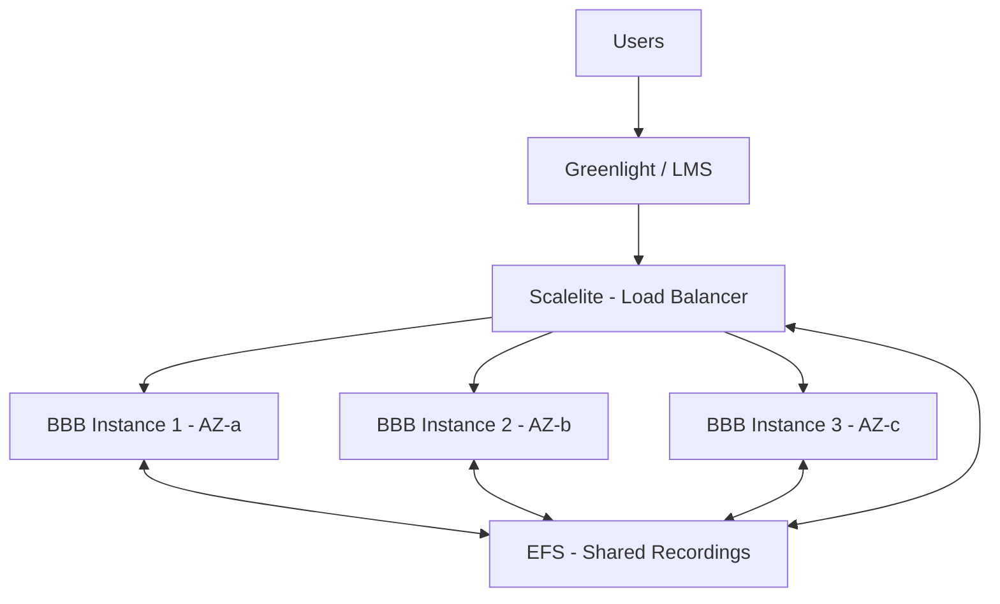

## Overview

### What it is
A multi-AZ BigBlueButton platform on AWS. EC2 instances run BigBlueButton, Scalelite routes meetings to the backend pool, and EFS stores recordings so any backend can write them and Scalelite can serve them from one endpoint.

I also deployed the supporting control plane around it: CloudFormation for infrastructure, Helm charts for Scalelite and Greenlight, systemd bootstrap scripts for instance lifecycle work, and Prometheus/Grafana/Loki for fleet visibility.

### Why it exists
BigBlueButton keeps each live meeting on one server and writes recordings to that server's disk. A single-node setup limits capacity, and a failed node can take recordings with it.

The platform needed more capacity without breaking live meetings during scale-in, losing recordings, or asking engineers to register each new server by hand.

### Outcome

:::tip Key Results
- Instance launch time dropped from 11 minutes to 3 with a custom AMI
- Auto Scaling protects instances that host active meetings
- EFS keeps recordings available through Scalelite from one endpoint
- Route53 records and Scalelite registration happen during instance lifecycle hooks
- Prometheus, Grafana, Loki, and Promtail cover metrics and logs across the fleet
:::

---

## Architecture

### High-Level Flow

```mermaid
graph TD
    A[Users] --> B[Greenlight / LMS]
    B --> C[Scalelite - Load Balancer]
    C --> D[BBB Instance 1 - AZ-a]
    C --> E[BBB Instance 2 - AZ-b]
    C --> F[BBB Instance 3 - AZ-c]
    D <--> G[EFS - Shared Recordings]
    E <--> G
    F <--> G
    C <--> G
```

:::info Key Components
Greenlight or an LMS sends users into Scalelite. Scalelite picks one BigBlueButton instance from the Auto Scaling Group and proxies the meeting there. Each BigBlueButton instance and the Scalelite pods mount the same EFS volume, so recordings stay reachable even when the backend pool changes.
:::

---

## Tech Stack

**Cloud & Infrastructure:** AWS, EC2, Auto Scaling Groups, EKS, EFS, Route53, CloudWatch  
**IaC:** CloudFormation  
**Automation:** Bash, systemd services, AWS CLI  
**Containers & Orchestration:** Kubernetes, EKS, Helm, Docker  
**Monitoring & Logging:** Prometheus, EC2 service discovery, Grafana, Loki, Promtail

---

## Implementation Setup

### Infrastructure Provisioning
- Multi-AZ VPC with public subnets
- Auto Scaling Group managed through CloudFormation
- EFS file system with backups for shared recordings
- Route53 hosted zone and per-instance DNS records
- CloudWatch alarms for scale-out and scale-in
- EKS cluster for Scalelite, Greenlight, and supporting services

### Custom AMI
I built a custom Ubuntu 22.04 AMI with BigBlueButton v3 and its dependencies installed. Instance bootstrap now handles only machine-specific work: hostname, DNS, certificates, Scalelite registration, EFS mount, and monitoring agents.

### Instance Lifecycle Automation
Systemd services run Bash scripts on launch and shutdown:
- Create and delete Route53 A records
- Configure BigBlueButton, FreeSWITCH, and TURN for the instance
- Register and deregister the server through the Scalelite API
- Mount EFS for recordings
- Install and start Promtail, bbb-exporter, and node-exporter
- Toggle scale-in protection when the instance hosts an active meeting

### Helm Charts
- Scalelite chart with database config and EFS mount
- Greenlight chart for the user-facing UI and auth settings
- Internal service exposure between EKS and the EC2 backend fleet

### Management Tooling
I built a CLI for stack lifecycle tasks: create, update, delete, validate, and sync. It validates CloudFormation templates, runs deployments, and keeps the S3 bucket for templates and bootstrap scripts in sync.

### Auto Scaling Strategy
- Scale out when the lowest CPU value across the fleet crosses 80%
- Scale in when the lowest CPU value falls below 6%
- Protect any instance with an active meeting from termination
- Use CloudWatch alarms to drive threshold policies
- Add scheduled capacity before planned webinars, exams, and large events

:::note Update Strategy
CloudFormation rolling updates launch new instances with the new config. Old instances stay in service until the new ones pass health checks.
:::

### Monitoring and Logging

**Metrics:**
- Prometheus uses EC2 service discovery, so new instances appear without manual target edits
- bbb-exporter reports BigBlueButton meetings, participants, recordings, and server state
- node-exporter reports CPU, memory, disk, and network

**Logs:**
- Loki runs behind an internal load balancer, reachable from EC2 but closed to the public internet
- Promtail on each instance ships system and BigBlueButton logs to Loki
- Grafana lets engineers search logs across the fleet from one place

**Dashboards:**
- Fleet health
- Live meeting capacity
- Active meetings and participants
- Recording processing
- Node saturation

---

## Key Challenges & Solutions

### Challenge 1: Slow Instance Launch Times

**Problem:** The first version took 11 minutes to launch one instance. Bootstrap installed BigBlueButton, dependencies, certificates, and config from scratch, so Auto Scaling could not react fast enough during traffic spikes.

**Solution:** I moved the heavy install work into a custom AMI. Bootstrap now handles only instance-specific configuration: hostname, DNS, certificates, Scalelite registration, EFS mount, and monitoring agents.

:::success Result
Launch time dropped from 11 minutes to 3, which gave scale-out enough time to catch real load spikes.
:::

---

### Challenge 2: Meeting Disruptions During Scale-In

**Problem:** Auto Scaling could terminate an EC2 instance that still hosted a live meeting. Everyone in that meeting would lose the session.

**Solution:** A systemd timer queries the BigBlueButton API for active meetings and toggles EC2 scale-in protection on the instance. The 6% CPU scale-in threshold keeps idle instances as the first candidates, and scale-in protection blocks termination for boxes still serving users.

:::success Result
Scale-in stopped dropping live meetings while the fleet still shrank after traffic fell.
:::

---

### Challenge 3: Centralized Recording Access

**Problem:** BigBlueButton writes recordings to the local disk of the instance that hosted the meeting. Scalelite presents one endpoint to clients, so it needs access to recordings from every backend.

**Solution:** I used EFS as the shared recording layer. Each BigBlueButton instance mounts the same EFS file system, and Scalelite pods mount it inside EKS. Backends write recordings once; Scalelite reads them from the shared mount. EFS backups cover recording loss, and the EC2 fleet and EKS cluster share VPC access.

:::success Result
Scalelite serves recordings from one endpoint regardless of which backend created them.
:::

---

### Challenge 4: Dynamic DNS and Server Registration

**Problem:** Each new BigBlueButton instance needs a DNS record, a certificate, and Scalelite registration before it can receive meetings. Manual setup would break as soon as the Auto Scaling Group added or removed capacity.

**Solution:** Launch and shutdown scripts handle the full lifecycle. On launch, the instance creates its Route53 A record, requests a Let's Encrypt certificate, mounts EFS, and registers with Scalelite through a shared secret. On shutdown, it deregisters from Scalelite and deletes its DNS record.

:::success Result
New instances join the meeting pool with DNS, TLS, shared storage, and Scalelite registration in place before bootstrap finishes.
:::
