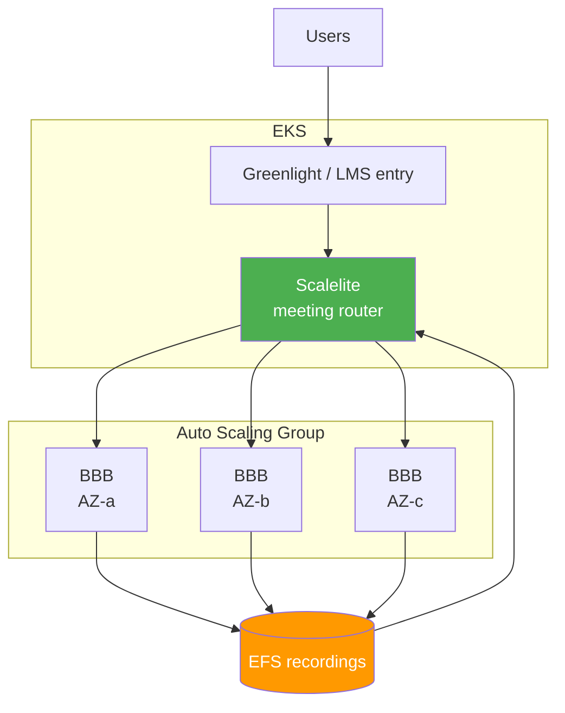

## Overview

### What it is
A multi-AZ BigBlueButton platform I built on AWS. EC2 instances run BigBlueButton, Scalelite routes meetings to the backend pool, and EFS stores recordings so any backend can write them and Scalelite can serve them from one endpoint.

I also deployed the supporting control plane around it: CloudFormation for infrastructure, Helm charts for Scalelite and Greenlight, systemd bootstrap scripts for instance lifecycle work, and Prometheus/Grafana/Loki for fleet visibility.

### Why it exists
BigBlueButton keeps each live meeting on one server and writes recordings to that server's disk. A single-node setup limits capacity, and a failed node can take recordings with it.

The platform needed more capacity without breaking live meetings during scale-in, losing recordings, or asking engineers to register each new server by hand.

### Outcome

:::tip Key Results
- Instance launch time dropped from 11 minutes to 3 with a custom AMI
- Scale-in stopped dropping live meetings: instances with active sessions hold termination protection
- Recordings survive any backend change: the fleet and Scalelite share one EFS volume
- New instances join with DNS, TLS, and Scalelite registration handled by lifecycle scripts
- Prometheus, Grafana, Loki, and Promtail cover metrics and logs across the fleet
:::

---

## Architecture

### High-Level Flow

```mermaid
graph TD
    U[Users] --> GL

    subgraph EKS ["EKS"]
        GL[Greenlight / LMS entry] --> SL[Scalelite<br/>meeting router]
    end

    subgraph ASG ["Auto Scaling Group"]
        B1[BBB<br/>AZ-a]
        B2[BBB<br/>AZ-b]
        B3[BBB<br/>AZ-c]
    end

    SL --> B1
    SL --> B2
    SL --> B3

    B1 & B2 & B3 --> EFS[(EFS recordings)]
    EFS --> SL

    style SL fill:#4CAF50,color:#fff
    style EFS fill:#FF9900,color:#fff
```

:::info Key Components
Greenlight or an LMS sends users into Scalelite. Scalelite picks one BigBlueButton instance from the Auto Scaling Group and proxies the meeting there. Each BigBlueButton instance and the Scalelite pods mount the same EFS volume, so recordings stay reachable even when the backend pool changes.
:::

---

## Implementation Highlights

- Scale-out triggers when the lowest CPU across the fleet crosses 80%, scale-in below 6%, with scheduled capacity added before planned webinars and exams. CloudFormation rolling updates keep old instances serving until new ones pass health checks.
- Systemd services run the launch and shutdown scripts: Route53 records, BigBlueButton and TURN config, Scalelite registration, EFS mounts, and monitoring agents.
- Prometheus discovers new instances through EC2 service discovery, bbb-exporter reports meetings and participants, and Promtail ships logs to Loki behind an internal load balancer.
- A CLI wraps stack lifecycle work: validate, create, update, delete, and sync of CloudFormation templates and bootstrap scripts in S3.

---

## Key Challenges & Solutions

### Challenge 1: Slow Instance Launch Times

**Problem:** The first version took 11 minutes to launch one instance. Bootstrap installed BigBlueButton, dependencies, certificates, and config from scratch, so Auto Scaling could not react fast enough during traffic spikes.

**Solution:** I moved the heavy install work into a custom AMI. Bootstrap now handles only instance-specific configuration: hostname, DNS, certificates, Scalelite registration, EFS mount, and monitoring agents.

:::success Result
Launch time dropped from 11 minutes to 3, which gave scale-out enough time to catch real load spikes.
:::

---

### Challenge 2: Meeting Disruptions During Scale-In

**Problem:** Auto Scaling could terminate an EC2 instance that still hosted a live meeting. Everyone in that meeting would lose the session.

**Solution:** A systemd timer queries the BigBlueButton API for active meetings and toggles EC2 scale-in protection on the instance. The 6% CPU scale-in threshold keeps idle instances as the first candidates, and scale-in protection blocks termination for boxes still serving users.

:::success Result
Scale-in stopped dropping live meetings while the fleet still shrank after traffic fell.
:::

---

### Challenge 3: Dynamic DNS and Server Registration

**Problem:** Each new BigBlueButton instance needs a DNS record, a certificate, and Scalelite registration before it can receive meetings. Manual setup would break as soon as the Auto Scaling Group added or removed capacity.

**Solution:** Launch and shutdown scripts handle the full lifecycle. On launch, the instance creates its Route53 A record, requests a Let's Encrypt certificate, mounts EFS, and registers with Scalelite through a shared secret. On shutdown, it deregisters from Scalelite and deletes its DNS record.

:::success Result
New instances join the meeting pool with DNS, TLS, shared storage, and Scalelite registration in place before bootstrap finishes.
:::
